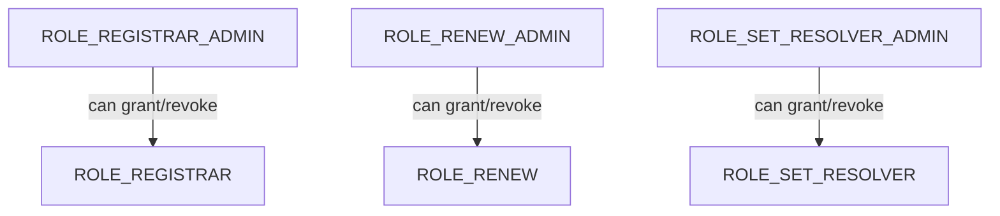

## Overview

The `RegistryRolesLib` library defines the role constants and admin role mappings used by the ENS v2 Registry contract. Each role is represented as a bit position in a `uint256` bitmap, enabling efficient storage and permission checks.

### Role Organization

Roles are organized by their scope:
- **Root-only roles**: Can only be granted/used in `ROOT_RESOURCE` (resource ID 0)
- **Root or token roles**: Can be granted in either `ROOT_RESOURCE` or specific name token resources
- **Token-only roles**: Can only be granted for specific name token resources

## Role Constants

### ROLE_REGISTRAR

```solidity
uint256 internal constant ROLE_REGISTRAR = 1 << 0
```

**Bit position**: 0  
**Scope**: Root-only  
**Permissions**: Allows registering new names in the registry

This role is restricted to the root resource level only. Accounts with this role can register new top-level or subdomains depending on the registry configuration.

### ROLE_REGISTRAR_ADMIN

```solidity
uint256 internal constant ROLE_REGISTRAR_ADMIN = ROLE_REGISTRAR << 128
```

**Bit position**: 128 (admin role for bit 0)  
**Scope**: Root-only  
**Permissions**: Can grant and revoke `ROLE_REGISTRAR`

The admin role for `ROLE_REGISTRAR`. Accounts with this role can manage who has registration privileges.

### ROLE_REGISTER_RESERVED

```solidity
uint256 internal constant ROLE_REGISTER_RESERVED = 1 << 4
```

**Bit position**: 4  
**Scope**: Root-only  
**Permissions**: Allows registering reserved names

This role grants the ability to register names that are marked as reserved in the system. Reserved names typically include premium names or names with special restrictions.

### ROLE_REGISTER_RESERVED_ADMIN

```solidity
uint256 internal constant ROLE_REGISTER_RESERVED_ADMIN = ROLE_REGISTER_RESERVED << 128
```

**Bit position**: 132 (admin role for bit 4)  
**Scope**: Root-only  
**Permissions**: Can grant and revoke `ROLE_REGISTER_RESERVED`

### ROLE_SET_PARENT

```solidity
uint256 internal constant ROLE_SET_PARENT = 1 << 8
```

**Bit position**: 8  
**Scope**: Root-only  
**Permissions**: Allows setting the parent relationship for names

This role enables modifying the hierarchical parent-child relationships between names in the registry.

### ROLE_SET_PARENT_ADMIN

```solidity
uint256 internal constant ROLE_SET_PARENT_ADMIN = ROLE_SET_PARENT << 128
```

**Bit position**: 136 (admin role for bit 8)  
**Scope**: Root-only  
**Permissions**: Can grant and revoke `ROLE_SET_PARENT`

### ROLE_UNREGISTER

```solidity
uint256 internal constant ROLE_UNREGISTER = 1 << 12
```

**Bit position**: 12  
**Scope**: Root or token  
**Permissions**: Allows unregistering names

This role can be granted either globally (in `ROOT_RESOURCE`) or for specific name tokens. When granted for a specific name, the holder can only unregister that particular name.

### ROLE_UNREGISTER_ADMIN

```solidity
uint256 internal constant ROLE_UNREGISTER_ADMIN = ROLE_UNREGISTER << 128
```

**Bit position**: 140 (admin role for bit 12)  
**Scope**: Root or token  
**Permissions**: Can grant and revoke `ROLE_UNREGISTER`

### ROLE_RENEW

```solidity
uint256 internal constant ROLE_RENEW = 1 << 16
```

**Bit position**: 16  
**Scope**: Root or token  
**Permissions**: Allows renewing name registrations

Accounts with this role can extend the expiration time of registered names. Can be granted globally or per-name.

### ROLE_RENEW_ADMIN

```solidity
uint256 internal constant ROLE_RENEW_ADMIN = ROLE_RENEW << 128
```

**Bit position**: 144 (admin role for bit 16)  
**Scope**: Root or token  
**Permissions**: Can grant and revoke `ROLE_RENEW`

### ROLE_SET_SUBREGISTRY

```solidity
uint256 internal constant ROLE_SET_SUBREGISTRY = 1 << 20
```

**Bit position**: 20  
**Scope**: Root or token  
**Permissions**: Allows setting a subregistry for a name

This role enables designating a name as a subregistry, allowing it to have its own registration rules and controllers.

### ROLE_SET_SUBREGISTRY_ADMIN

```solidity
uint256 internal constant ROLE_SET_SUBREGISTRY_ADMIN = ROLE_SET_SUBREGISTRY << 128
```

**Bit position**: 148 (admin role for bit 20)  
**Scope**: Root or token  
**Permissions**: Can grant and revoke `ROLE_SET_SUBREGISTRY`

### ROLE_SET_RESOLVER

```solidity
uint256 internal constant ROLE_SET_RESOLVER = 1 << 24
```

**Bit position**: 24  
**Scope**: Root or token  
**Permissions**: Allows setting the resolver contract for a name

This role grants permission to update which resolver contract is responsible for resolving a name to its associated data (addresses, content hashes, etc.).

### ROLE_SET_RESOLVER_ADMIN

```solidity
uint256 internal constant ROLE_SET_RESOLVER_ADMIN = ROLE_SET_RESOLVER << 128
```

**Bit position**: 152 (admin role for bit 24)  
**Scope**: Root or token  
**Permissions**: Can grant and revoke `ROLE_SET_RESOLVER`

### ROLE_CAN_TRANSFER_ADMIN

```solidity
uint256 internal constant ROLE_CAN_TRANSFER_ADMIN = (1 << 28) << 128
```

**Bit position**: 156 (bit 28 shifted to admin range)  
**Scope**: Token-only  
**Permissions**: Can grant and revoke the ability to transfer a name token

**Note**: This is an admin-only role (no corresponding regular role at bit 28). It controls whether a name token can be transferred. This provides fine-grained control over name transferability on a per-name basis.

### ROLE_UPGRADE

```solidity
uint256 internal constant ROLE_UPGRADE = 1 << 124
```

**Bit position**: 124  
**Scope**: Root-only  
**Permissions**: Allows upgrading the registry contract

This is a highly privileged role that permits upgrading the registry contract implementation. Should be carefully controlled.

### ROLE_UPGRADE_ADMIN

```solidity
uint256 internal constant ROLE_UPGRADE_ADMIN = ROLE_UPGRADE << 128
```

**Bit position**: 252 (admin role for bit 124)  
**Scope**: Root-only  
**Permissions**: Can grant and revoke `ROLE_UPGRADE`

## Role Hierarchy

The admin role system creates a hierarchical permission structure:



An account with an admin role can:
- Grant the corresponding regular role to other accounts
- Revoke the corresponding regular role from other accounts
- Grant the admin role itself to other accounts (if they hold that admin role)

## Usage Examples

### Checking a Single Role

```solidity
import {RegistryRolesLib} from "./libraries/RegistryRolesLib.sol";

// Check if account has ROLE_REGISTRAR in ROOT_RESOURCE
bool canRegister = registry.hasRootRoles(
    RegistryRolesLib.ROLE_REGISTRAR,
    msg.sender
);
```

### Checking Multiple Roles

```solidity
// Check if account has both ROLE_REGISTRAR and ROLE_REGISTER_RESERVED
uint256 requiredRoles = RegistryRolesLib.ROLE_REGISTRAR | 
                        RegistryRolesLib.ROLE_REGISTER_RESERVED;

bool hasAllRoles = registry.hasRootRoles(requiredRoles, msg.sender);
```

### Granting a Role

```solidity
// Grant ROLE_REGISTRAR to an address (requires ROLE_REGISTRAR_ADMIN)
registry.grantRootRoles(
    RegistryRolesLib.ROLE_REGISTRAR,
    0x1234567890123456789012345678901234567890
);
```

### Granting Resource-Specific Roles

```solidity
// Grant ROLE_SET_RESOLVER for a specific name only
uint256 nameId = uint256(keccak256("vitalik.eth"));
registry.grantRoles(
    nameId,
    RegistryRolesLib.ROLE_SET_RESOLVER,
    nameOwner
);

// The nameOwner can now set the resolver for "vitalik.eth" only
```

### Setting Up Initial Permissions

```solidity
// Deploy and set up initial admin
contract RegistryDeployment {
    function deployAndInitialize() external {
        Registry registry = new Registry();
        
        // Grant yourself all admin roles
        uint256 allAdminRoles = RegistryRolesLib.ROLE_REGISTRAR_ADMIN |
                                RegistryRolesLib.ROLE_REGISTER_RESERVED_ADMIN |
                                RegistryRolesLib.ROLE_SET_PARENT_ADMIN |
                                RegistryRolesLib.ROLE_UNREGISTER_ADMIN |
                                RegistryRolesLib.ROLE_RENEW_ADMIN |
                                RegistryRolesLib.ROLE_SET_SUBREGISTRY_ADMIN |
                                RegistryRolesLib.ROLE_SET_RESOLVER_ADMIN |
                                RegistryRolesLib.ROLE_UPGRADE_ADMIN;
        
        registry.grantRootRoles(allAdminRoles, msg.sender);
    }
}
```

### Delegating Name-Specific Permissions

```solidity
// Allow a specific address to renew only their own name
uint256 nameId = uint256(keccak256("alice.eth"));

// Grant ROLE_RENEW for this specific name
registry.grantRoles(
    nameId,
    RegistryRolesLib.ROLE_RENEW,
    aliceAddress
);

// Alice can now renew "alice.eth" but no other names
```

### Transfer Control Example

```solidity
// Prevent a name from being transferred by revoking transfer admin
uint256 nameId = uint256(keccak256("locked.eth"));

// First, account must have ROLE_CAN_TRANSFER_ADMIN for this name
registry.revokeRoles(
    nameId,
    RegistryRolesLib.ROLE_CAN_TRANSFER_ADMIN,
    currentAdmin
);

// Now the name cannot be transferred until ROLE_CAN_TRANSFER_ADMIN is granted again
```

### Checking Admin Capabilities

```solidity
// Check if an account can grant ROLE_REGISTRAR
bool canGrantRegistrar = registry.hasRootRoles(
    RegistryRolesLib.ROLE_REGISTRAR_ADMIN,
    msg.sender
);

if (canGrantRegistrar) {
    // Can safely call grantRootRoles with ROLE_REGISTRAR
    registry.grantRootRoles(RegistryRolesLib.ROLE_REGISTRAR, newRegistrar);
}
```

## Role Bitmap Layout

The role bitmap is structured as follows:

```
Bits 0-127:   Regular roles (32 roles × 4 bits each)
Bits 128-255: Admin roles (32 admin roles × 4 bits each)
```

Each role occupies a single bit in the lower 128 bits, and its corresponding admin role is at the same bit position shifted left by 128 bits.

**Example**:
- `ROLE_REGISTRAR` = bit 0 (value: `0x1`)
- `ROLE_REGISTRAR_ADMIN` = bit 128 (value: `0x100000000000000000000000000000000`)

## Best Practices

### 1. Principle of Least Privilege

Only grant the minimum roles necessary for an account to perform its function:

```solidity
// Good: Grant specific role for specific name
registry.grantRoles(nameId, RegistryRolesLib.ROLE_SET_RESOLVER, nameManager);

// Avoid: Granting admin role when regular role suffices
// registry.grantRoles(nameId, RegistryRolesLib.ROLE_SET_RESOLVER_ADMIN, nameManager);
```

### 2. Separate Admin Accounts

Keep admin roles on separate, more secure accounts:

```solidity
// Use a multisig or hardware wallet for admin roles
address adminMultisig = 0x123...;
registry.grantRootRoles(RegistryRolesLib.ROLE_REGISTRAR_ADMIN, adminMultisig);

// Use a hot wallet for operational roles
registry.grantRootRoles(RegistryRolesLib.ROLE_REGISTRAR, operationalAccount);
```

### 3. Use Resource-Specific Roles When Possible

Prefer granting roles for specific resources rather than globally:

```solidity
// Preferred: Grant resolver role for specific name
registry.grantRoles(nameId, RegistryRolesLib.ROLE_SET_RESOLVER, nameOwner);

// Avoid when possible: Global resolver role
// registry.grantRootRoles(RegistryRolesLib.ROLE_SET_RESOLVER, nameOwner);
```

### 4. Role Combination for Complex Permissions

Combine roles for accounts that need multiple permissions:

```solidity
// Grant multiple roles in a single transaction
uint256 nameManagerRoles = RegistryRolesLib.ROLE_RENEW |
                           RegistryRolesLib.ROLE_SET_RESOLVER |
                           RegistryRolesLib.ROLE_SET_SUBREGISTRY;

registry.grantRoles(nameId, nameManagerRoles, nameManager);
```

### 5. Audit Role Assignments

Regularly check who has critical roles:

```solidity
function auditCriticalRoles(uint256 resource, address account) external view {
    uint256 roles = registry.roles(resource, account);
    
    bool hasUpgrade = (roles & RegistryRolesLib.ROLE_UPGRADE) != 0;
    bool hasUpgradeAdmin = (roles & RegistryRolesLib.ROLE_UPGRADE_ADMIN) != 0;
    
    // Log or alert if unexpected accounts have these roles
}
```

## Role Scope Reference

| Role | Bit Position | Scope | Description |
|------|--------------|-------|-------------|
| `ROLE_REGISTRAR` | 0 | Root-only | Register new names |
| `ROLE_REGISTRAR_ADMIN` | 128 | Root-only | Manage registrar role |
| `ROLE_REGISTER_RESERVED` | 4 | Root-only | Register reserved names |
| `ROLE_REGISTER_RESERVED_ADMIN` | 132 | Root-only | Manage reserved registration role |
| `ROLE_SET_PARENT` | 8 | Root-only | Set parent relationships |
| `ROLE_SET_PARENT_ADMIN` | 136 | Root-only | Manage parent role |
| `ROLE_UNREGISTER` | 12 | Root or token | Unregister names |
| `ROLE_UNREGISTER_ADMIN` | 140 | Root or token | Manage unregister role |
| `ROLE_RENEW` | 16 | Root or token | Renew registrations |
| `ROLE_RENEW_ADMIN` | 144 | Root or token | Manage renew role |
| `ROLE_SET_SUBREGISTRY` | 20 | Root or token | Set subregistries |
| `ROLE_SET_SUBREGISTRY_ADMIN` | 148 | Root or token | Manage subregistry role |
| `ROLE_SET_RESOLVER` | 24 | Root or token | Set resolver contracts |
| `ROLE_SET_RESOLVER_ADMIN` | 152 | Root or token | Manage resolver role |
| `ROLE_CAN_TRANSFER_ADMIN` | 156 | Token-only | Control transfer ability |
| `ROLE_UPGRADE` | 124 | Root-only | Upgrade registry |
| `ROLE_UPGRADE_ADMIN` | 252 | Root-only | Manage upgrade role |

## See Also

- [EnhancedAccessControl](/api/access-control/enhanced-access-control) - Base access control contract
- Source: `contracts/src/registry/libraries/RegistryRolesLib.sol:4`
