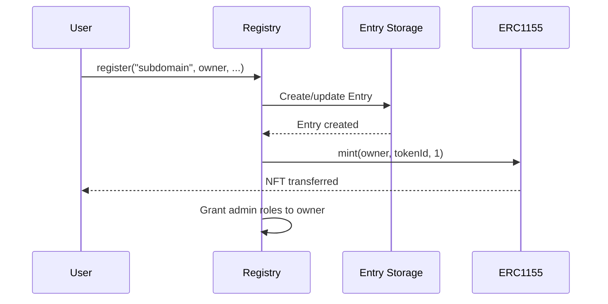
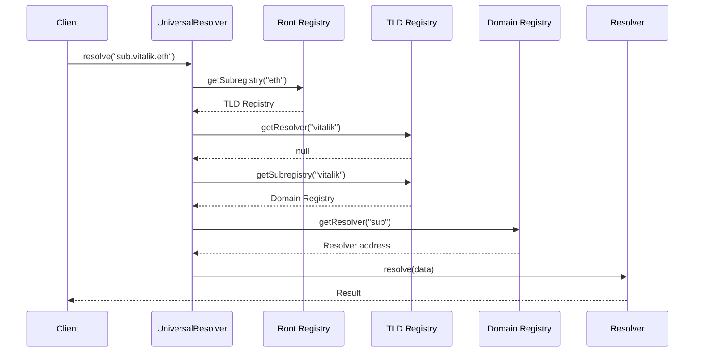

## Overview

ENS v2 represents a fundamental architectural shift from the flat, monolithic ENS v1 registry to a hierarchical, modular system. This new design enables flexible ownership models, improved gas efficiency, and better cross-chain functionality.

<Info>
  **Key Paradigm Shift**: Instead of one global registry storing all names, ENS v2 uses a tree of independent registry contracts, where each name can have its own registry managing its subdomains.
</Info>

## Core Architecture Principles

### Hierarchical Registry Model

ENS v2 organizes registries in a tree structure that mirrors the DNS hierarchy:

```
Root Registry ("")
  ↓
TLD Registries (.eth, .box, etc.)
  ↓
Domain Registries (example.eth)
  ↓
Subdomain Registries (sub.example.eth)
```

Each registry:
- Is responsible for **one name** and its **direct subdomains**
- Implements the `IRegistry` interface for standard resolution
- Can have a custom implementation with different ownership models
- Stores data in the centralized `RegistryDatastore` for gas efficiency

### Registry as NFT Container

Every registry implements ERC1155Singleton, treating subdomains as NFT tokens:

```solidity
interface IRegistry is IERC1155Singleton {
    // Get the subregistry for a label
    function getSubregistry(string calldata label) external view returns (IRegistry);
    
    // Get the resolver for a label
    function getResolver(string calldata label) external view returns (address);
    
    // Get canonical parent location
    function getParent() external view returns (IRegistry parent, string memory label);
}
```

**Example**: The `.eth` registry manages all second-level domains like `vitalik.eth`, `nick.eth` as individual NFT tokens.

## Core Components

### 1. Registry Contracts

Registries are the fundamental building blocks:

<CodeGroup>

```solidity IRegistry Interface
// Minimal interface all registries must implement
interface IRegistry is IERC1155Singleton {
    function getSubregistry(string calldata label) external view returns (IRegistry);
    function getResolver(string calldata label) external view returns (address);
    function getParent() external view returns (IRegistry parent, string memory label);
}
```

```solidity PermissionedRegistry
// Feature-complete implementation with role-based access control
contract PermissionedRegistry is IRegistry, ERC1155Singleton, EnhancedAccessControl {
    // Manages subdomains as ERC1155 tokens
    // Supports 32 roles with granular permissions
    // Handles expiry, renewal, and registration
}
```

</CodeGroup>

#### Registry Storage Structure

Each name in a registry has an associated entry:

```solidity
struct Entry {
    uint32 eacVersionId;        // Access control version (increments on role changes)
    uint32 tokenVersionId;      // Token version (increments on re-registration)
    IRegistry subregistry;      // Registry contract for subdomains
    uint64 expiry;              // Expiration timestamp (0 = never expires)
    address resolver;           // Resolver contract for this name
}
```

**Reference**: [`PermissionedRegistry.sol:56-62`](/home/daytona/workspace/source/contracts/src/registry/PermissionedRegistry.sol#L56-L62)

### 2. Universal Resolver

The `UniversalResolverV2` provides a single entry point for resolving any ENS name:

```solidity
contract UniversalResolverV2 {
    IRegistry public immutable ROOT_REGISTRY;
    
    // Resolve any record for any name
    function resolve(bytes memory name, bytes memory data) 
        external view 
        returns (bytes memory result, address resolver);
    
    // Find the resolver by traversing the registry hierarchy
    function findResolver(bytes memory name) 
        public view 
        returns (address resolver, bytes32 node, uint256 offset);
}
```

**Key Features**:
- Recursive traversal through the registry hierarchy
- Wildcard resolution support (parent resolvers can handle subdomains)
- CCIP-Read support for off-chain resolution
- Batch resolution capabilities

**Reference**: [`UniversalResolverV2.sol`](/home/daytona/workspace/source/contracts/src/universalResolver/UniversalResolverV2.sol)

### 3. Enhanced Access Control (EAC)

EAC provides resource-scoped, role-based permissions:

<AccordionGroup>
  <Accordion title="Resource-Scoped Permissions">
    Unlike traditional role systems, EAC assigns roles to specific resources (individual names) rather than contract-wide:
    
    ```solidity
    // Grant resolver permission for a specific name
    registry.grantRoles(tokenId, ROLE_SET_RESOLVER, operatorAddress);
    
    // Grant resolver permission for ALL names in the registry
    registry.grantRootRoles(ROLE_SET_RESOLVER, adminAddress);
    ```
  </Accordion>
  
  <Accordion title="Paired Admin Roles">
    Each regular role has a corresponding admin role that can grant/revoke it:
    
    ```solidity
    // Regular role at bit position N
    uint256 ROLE_SET_RESOLVER = 1 << 24;
    
    // Admin role at bit position N + 128
    uint256 ROLE_SET_RESOLVER_ADMIN = ROLE_SET_RESOLVER << 128;
    ```
  </Accordion>
  
  <Accordion title="Root Resource Override">
    The special `ROOT_RESOURCE` (value `0`) provides contract-wide permissions:
    
    ```solidity
    // This user can set resolvers for ALL names
    if (hasRoles(ROOT_RESOURCE, ROLE_SET_RESOLVER, user)) {
        // Applies to all resources in the registry
    }
    ```
  </Accordion>
</AccordionGroup>

**Reference**: [`EnhancedAccessControl.sol`](/home/daytona/workspace/source/contracts/src/access-control/EnhancedAccessControl.sol)

### 4. ERC1155Singleton Token Standard

A gas-optimized variant of ERC1155 that enforces one token per ID:

```solidity
abstract contract ERC1155Singleton is IERC1155 {
    // Stores owner directly instead of balance
    mapping(uint256 id => address owner) private _owners;
    
    // Returns owner like ERC721
    function ownerOf(uint256 id) public view returns (address);
    
    // Balance is always 0 or 1
    function balanceOf(address account, uint256 id) public view returns (uint256) {
        return ownerOf(id) == account ? 1 : 0;
    }
}
```

**Benefits**:
- Saves gas by eliminating balance tracking
- Provides familiar `ownerOf()` interface like ERC721
- Maintains ERC1155 compatibility for marketplace support

**Reference**: [`ERC1155Singleton.sol`](/home/daytona/workspace/source/contracts/src/erc1155/ERC1155Singleton.sol)

## Data Flow Architecture

### Registration Flow



### Resolution Flow



## Comparison: ENS v1 vs ENS v2

<CardGroup cols={2}>
  <Card title="ENS v1" icon="square">
    **Flat Registry Model**
    - Single monolithic registry contract
    - One ownership model for all names
    - Limited extensibility
    - Higher gas costs for complex operations
    - Name Wrapper required for advanced features
  </Card>
  
  <Card title="ENS v2" icon="layer-group">
    **Hierarchical Registry Model**
    - Independent registry per name
    - Custom ownership models per registry
    - Highly extensible and composable
    - Optimized gas usage
    - Advanced features built-in
  </Card>
</CardGroup>

### Key Improvements

| Feature | ENS v1 | ENS v2 |
|---------|--------|--------|
| **Architecture** | Flat, single registry | Hierarchical, multiple registries |
| **Ownership Models** | Fixed | Customizable per registry |
| **Access Control** | Owner-only | 32 granular roles |
| **Subdomains** | Manual delegation | Automatic via subregistries |
| **Gas Efficiency** | Moderate | Optimized |
| **Token Standard** | Name Wrapper (ERC1155) | Native ERC1155Singleton |
| **Backward Compatibility** | N/A | Full ENS v1 support |

## Design Patterns

### 1. Registry Composition

Registries can be composed to create complex ownership structures:

```solidity
// Create a custom registry for your domain
PermissionedRegistry myRegistry = new PermissionedRegistry(
    hcaFactory,
    metadata,
    owner,
    ROLE_REGISTRAR_ADMIN | ROLE_SET_RESOLVER_ADMIN
);

// Set it as the subregistry for your name
parentRegistry.setSubregistry(myTokenId, myRegistry);
```

### 2. Emancipated Names

Create names that the parent cannot interfere with:

```solidity
// 1. Create subregistry with no root roles for owner
IRegistry subregistry = new PermissionedRegistry(
    hcaFactory,
    metadata,
    subdomainOwner,
    0  // No root-level roles
);

// 2. Lock the subregistry into parent (make it immutable)
parentRegistry.setSubregistry(tokenId, subregistry);
parentRegistry.revokeRoles(tokenId, ROLE_SET_SUBREGISTRY, parentOwner);

// Result: Parent owner cannot change or interfere with subdomain
```

### 3. Soulbound Names

Create non-transferable names by revoking transfer permissions:

```solidity
// Revoke the transfer admin role from yourself
registry.revokeRoles(tokenId, ROLE_CAN_TRANSFER_ADMIN, msg.sender);

// Name is now permanently bound to current owner
```

**Reference**: [`RegistryRolesLib.sol:34`](/home/daytona/workspace/source/contracts/src/registry/libraries/RegistryRolesLib.sol#L34)

## Security Considerations

<Warning>
  **Important Security Properties**:
  
  1. **Admin Role Restrictions**: In registries, only the name owner can hold admin roles to prevent permission retention after transfer
  2. **Token Regeneration**: Token IDs regenerate on role changes to prevent marketplace griefing
  3. **Expiry Checks**: All operations verify name expiry before allowing modifications
  4. **Permission Inheritance**: Root-level permissions automatically apply to all names
</Warning>

### Admin Role Protection

The registry prevents admin roles from being granted to external accounts:

```solidity
function _getSettableRoles(uint256 resource, address account) 
    internal view virtual override returns (uint256) 
{
    uint256 allRoles = super.roles(resource, account) | super.roles(ROOT_RESOURCE, account);
    uint256 adminRoleBitmap = allRoles & EACBaseRolesLib.ADMIN_ROLES;
    // Can only grant regular roles, not admin roles
    return adminRoleBitmap >> 128;
}
```

**Reference**: [`PermissionedRegistry.sol:447-454`](/home/daytona/workspace/source/contracts/src/registry/PermissionedRegistry.sol#L447-L454)

## Next Steps

<CardGroup cols={2}>
  <Card title="Hierarchical Registries" icon="sitemap" href="/concepts/hierarchical-registries">
    Learn how registries work together in the hierarchy
  </Card>
  
  <Card title="Canonical ID System" icon="fingerprint" href="/concepts/canonical-id-system">
    Understand the mutable token ID system
  </Card>
  
  <Card title="Resolution Process" icon="route" href="/concepts/resolution-process">
    Discover how name resolution traverses the hierarchy
  </Card>
  
  <Card title="Registry Roles" icon="user-lock" href="/access-control/registry-roles">
    Explore the role-based permission system
  </Card>
</CardGroup>