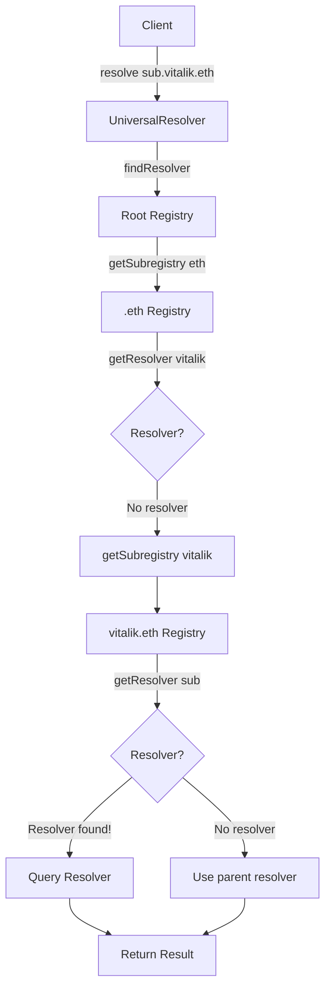

## Overview

Name resolution in ENS v2 is fundamentally different from v1. Instead of a single lookup in a flat registry, resolution involves **recursive traversal** through a hierarchy of registry contracts, searching for the deepest resolver that can handle the query.

<Info>
  **Core Principle**: Resolution walks down the registry tree from root to leaf, remembering the last resolver it found. If no exact resolver exists for a name, its parent's resolver may handle it (wildcard resolution).
</Info>

## The Resolution Journey

### High-Level Flow

```
Query: "What is the address for sub.vitalik.eth?"

1. Start at Root Registry
   ↓
2. Traverse to .eth Registry (remember: no resolver set)
   ↓
3. Traverse to vitalik.eth (remember: resolver = 0x123...)
   ↓
4. Look for sub.vitalik.eth (no registry exists)
   ↓
5. Use vitalik.eth's resolver (0x123...)
   ↓
6. Query resolver for sub.vitalik.eth's address
   ↓
7. Return result
```

### Visual Representation



## The findResolver Algorithm

The core resolution logic is implemented in `LibRegistry.findResolver`:

```solidity
function findResolver(
    IRegistry rootRegistry,
    bytes memory name,
    uint256 offset
) internal view returns (
    IRegistry exactRegistry,
    address resolver,
    bytes32 node,
    uint256 resolverOffset
) {
    // Read the next label from the DNS-encoded name
    (bytes32 labelHash, uint256 next) = NameCoder.readLabel(name, offset);
    
    // Base case: reached the end (root)
    if (labelHash == bytes32(0)) {
        return (rootRegistry, address(0), bytes32(0), offset);
    }
    
    // Recursive case: process parent first
    (exactRegistry, resolver, node, resolverOffset) = findResolver(
        rootRegistry, 
        name, 
        next  // Continue with next label
    );
    
    // If we found a registry for the parent
    if (address(exactRegistry) != address(0)) {
        (string memory label, ) = NameCoder.extractLabel(name, offset);
        
        // Check if this level has a resolver
        address res = exactRegistry.getResolver(label);
        if (res != address(0)) {
            resolver = res;           // Remember this resolver
            resolverOffset = offset;  // Remember where we found it
        }
        
        // Try to go deeper
        exactRegistry = exactRegistry.getSubregistry(label);
    }
    
    // Update namehash for this level
    node = NameCoder.namehash(node, labelHash);
}
```

**Reference**: [`LibRegistry.sol:19-47`](/home/daytona/workspace/source/contracts/src/universalResolver/libraries/LibRegistry.sol#L19-L47)

### Breaking Down the Algorithm

<Steps>
  <Step title="Recursion Strategy">
    The function processes labels in **reverse order** (right to left):
    
    ```
    Name: "sub.vitalik.eth"
    
    Process order:
    1. "eth" (via recursion)
    2. "vitalik" (via recursion)
    3. "sub" (current call)
    ```
    
    This builds up the path from root to target.
  </Step>
  
  <Step title="Registry Traversal">
    At each level, check if a subregistry exists:
    
    ```solidity
    exactRegistry = exactRegistry.getSubregistry(label);
    ```
    
    - If `exactRegistry != address(0)`: path continues
    - If `exactRegistry == address(0)`: we've hit a leaf (or expired name)
  </Step>
  
  <Step title="Resolver Collection">
    Remember the **last resolver** found during traversal:
    
    ```solidity
    address res = exactRegistry.getResolver(label);
    if (res != address(0)) {
        resolver = res;           // Overwrite previous resolver
        resolverOffset = offset;  // Track where we found it
    }
    ```
    
    This implements wildcard resolution.
  </Step>
  
  <Step title="Namehash Construction">
    Build the ENS namehash incrementally:
    
    ```solidity
    node = NameCoder.namehash(node, labelHash);
    ```
    
    This creates the node identifier needed for resolver queries.
  </Step>
</Steps>

## Wildcard Resolution

Wildcard resolution allows a resolver to handle names it doesn't explicitly know about.

### How It Works

```solidity
// Setup: vitalik.eth has a resolver but sub.vitalik.eth does not exist

vitalikRegistry.getResolver("")  // Returns: 0x123... (set on vitalik.eth)

// When resolving sub.vitalik.eth:
// 1. Traverse to vitalikRegistry
// 2. Look for resolver on "sub" → not found
// 3. Look for subregistry for "sub" → not found
// 4. Fall back to vitalik.eth's resolver (0x123...)
// 5. Resolver 0x123... handles the query for sub.vitalik.eth
```

### Wildcard Use Cases

<AccordionGroup>
  <Accordion title="IPFS Gateway Pattern">
    ```solidity
    // Setup: ipfs.eth has a wildcard resolver
    ethRegistry.register(
        "ipfs",
        owner,
        IRegistry(address(0)),  // No subregistry!
        ipfsGatewayResolver,    // Handles all *.ipfs.eth
        roles,
        expiry
    );
    
    // Now ANY subdomain works:
    // - {cid}.ipfs.eth → ipfsGatewayResolver
    // - another.ipfs.eth → ipfsGatewayResolver
    // - deeply.nested.ipfs.eth → ipfsGatewayResolver
    ```
  </Accordion>
  
  <Accordion title="App Subdomain Router">
    ```solidity
    // Setup: myapp.eth routes all subdomains to an app resolver
    ethRegistry.register(
        "myapp",
        owner,
        IRegistry(address(0)),
        appSubdomainResolver,  // Handles user.myapp.eth, api.myapp.eth, etc.
        roles,
        expiry
    );
    
    // The resolver can:
    // - Parse the subdomain from the query
    // - Route to different backends
    // - Generate responses dynamically
    ```
  </Accordion>
  
  <Accordion title="Organization Hierarchy">
    ```solidity
    // Setup: company.eth has departments
    companyRegistry.register(
        "engineering",
        deptOwner,
        IRegistry(address(0)),
        deptResolver,  // Handles *.engineering.company.eth
        roles,
        expiry
    );
    
    // Allows:
    // - alice.engineering.company.eth
    // - bob.engineering.company.eth
    // Without registering each name individually
    ```
  </Accordion>
</AccordionGroup>

### Preventing Wildcard Resolution

To ensure a name has its own explicit resolver:

```solidity
// Create a subregistry even if empty
IRegistry subRegistry = new PermissionedRegistry(...);

parentRegistry.register(
    "sub",
    owner,
    subRegistry,           // Subregistry exists
    specificResolver,      // This exact resolver will be used
    roles,
    expiry
);

// Now sub.parent.eth uses specificResolver
// NOT the parent's resolver
```

## Resolution Entry Points

### UniversalResolverV2.resolve

The main entry point for resolution:

```solidity
function resolve(bytes memory name, bytes memory data) 
    external view 
    returns (bytes memory result, address resolverAddress) 
{
    // Find the resolver for this name
    (address resolver, bytes32 node, ) = findResolver(name);
    
    if (resolver == address(0)) {
        revert ResolverNotFound();
    }
    
    // Query the resolver (with CCIP-Read support)
    result = _resolve(resolver, data, node);
    resolverAddress = resolver;
}
```

### UniversalResolverV2.findResolver

```solidity
function findResolver(bytes memory name) 
    public view 
    returns (address resolver, bytes32 node, uint256 offset) 
{
    // Use LibRegistry to traverse the hierarchy
    (, resolver, node, offset) = LibRegistry.findResolver(
        ROOT_REGISTRY, 
        name, 
        0  // Start at beginning of name
    );
}
```

**Reference**: [`UniversalResolverV2.sol:52-57`](/home/daytona/workspace/source/contracts/src/universalResolver/UniversalResolverV2.sol#L52-L57)

## Advanced Resolution Patterns

### Finding Exact Registry

Get the registry for a specific name (if it exists):

```solidity
function findExactRegistry(
    IRegistry rootRegistry,
    bytes memory name,
    uint256 offset
) internal view returns (IRegistry exactRegistry) {
    (bytes32 labelHash, uint256 next) = NameCoder.readLabel(name, offset);
    
    // Base case: root
    if (labelHash == bytes32(0)) {
        return rootRegistry;
    }
    
    // Recurse to parent
    IRegistry parent = findExactRegistry(rootRegistry, name, next);
    
    // Get subregistry from parent
    if (address(parent) != address(0)) {
        (string memory label, ) = NameCoder.extractLabel(name, offset);
        exactRegistry = parent.getSubregistry(label);
    }
}
```

**Reference**: [`LibRegistry.sol:146-160`](/home/daytona/workspace/source/contracts/src/universalResolver/libraries/LibRegistry.sol#L146-L160)

### Finding All Registries

Get every registry in a name's ancestry:

```solidity
IRegistry[] memory registries = universalResolver.findRegistries(
    dnsEncode("sub.vitalik.eth")
);

// Returns: [<sub registry or null>, <vitalik registry>, <eth registry>, <root>]
// Length = number of labels + 1 (for root)
```

**Use cases**:
- Understanding the full resolution path
- Checking which registries exist vs don't exist
- Debugging resolution issues

**Reference**: [`LibRegistry.sol:186-212`](/home/daytona/workspace/source/contracts/src/universalResolver/libraries/LibRegistry.sol#L186-L212)

### Canonical Name Construction

Given a registry, construct its canonical name:

```solidity
bytes memory canonicalName = universalResolver.findCanonicalName(registry);

// Returns DNS-encoded name or empty if not canonical
```

Algorithm:
1. Get registry's parent and label via `getParent()`
2. Verify parent's `getSubregistry(label)` points back to registry
3. Recurse to parent
4. Build name from accumulated labels

**Reference**: [`LibRegistry.sol:97-119`](/home/daytona/workspace/source/contracts/src/universalResolver/libraries/LibRegistry.sol#L97-L119)

## CCIP-Read Support

ENS v2 supports CCIP-Read (EIP-3668) for off-chain resolution:

```solidity
// If resolver reverts with OffchainLookup:
try resolver.resolve(node, data) returns (bytes memory result) {
    return result;
} catch (bytes memory error) {
    // Check if it's CCIP-Read revert
    if (bytes4(error) == OffchainLookup.selector) {
        // Client should make off-chain request
        // Then call back with proof
    }
}
```

<Info>
  **CCIP-Read** enables resolvers to fetch data from off-chain sources (L2s, databases, etc.) while maintaining security through cryptographic proofs.
</Info>

## Resolution Examples

### Example 1: Full Resolution Path

```solidity
// Setup:
// - root has no resolver
// - .eth has no resolver  
// - vitalik.eth has resolver 0xAAA
// - sub.vitalik.eth has no registry (wildcard)

// Resolution of "sub.vitalik.eth":

IRegistry root = ROOT_REGISTRY;
IRegistry eth = root.getSubregistry("eth");           // Found
address resolver = eth.getResolver("vitalik");        // Returns 0xAAA ✓
IRegistry vitalik = eth.getSubregistry("vitalik");    // Found
address subResolver = vitalik.getResolver("sub");     // Returns address(0)
IRegistry sub = vitalik.getSubregistry("sub");        // Returns address(0)

// Final result: resolver = 0xAAA (from vitalik.eth)
// Query 0xAAA for sub.vitalik.eth's records
```

### Example 2: Multi-Level Wildcards

```solidity
// Setup:
// - app.eth has resolver 0xBBB
// - No subregistry for app.eth

// Resolution of "very.deep.nested.app.eth":

IRegistry eth = root.getSubregistry("eth");           // Found
address resolver = eth.getResolver("app");            // Returns 0xBBB ✓
IRegistry app = eth.getSubregistry("app");            // Returns address(0)

// Traversal stops here
// Final result: resolver = 0xBBB
// Resolver handles very.deep.nested.app.eth
```

### Example 3: Exact Match

```solidity
// Setup:
// - vitalik.eth has resolver 0xAAA
// - sub.vitalik.eth has its own registry with resolver 0xCCC

// Resolution of "sub.vitalik.eth":

IRegistry eth = root.getSubregistry("eth");           // Found
address resolver = eth.getResolver("vitalik");        // Returns 0xAAA
IRegistry vitalik = eth.getSubregistry("vitalik");    // Found
address subResolver = vitalik.getResolver("sub");     // Returns 0xCCC ✓
IRegistry sub = vitalik.getSubregistry("sub");        // Found

// Final result: resolver = 0xCCC (exact match)
// Query 0xCCC for sub.vitalik.eth's records
```

## Performance Considerations

### Gas Costs

Resolution gas cost scales with name depth:

```
- 2-label name (vitalik.eth):     ~30,000 gas
- 3-label name (sub.vitalik.eth): ~45,000 gas  
- 4-label name:                   ~60,000 gas
```

Each additional level adds:
- 1 `getSubregistry()` call (~5,000 gas)
- 1 `getResolver()` call (~5,000 gas)
- Storage reads for expiry checks (~2,100 gas per SLOAD)

### Optimization Strategies

<CardGroup cols={2}>
  <Card title="Shallow Hierarchies" icon="layer-group">
    Keep names as shallow as possible. `user.app.eth` is cheaper than `user.team.dept.app.eth`.
  </Card>
  
  <Card title="Batch Queries" icon="layer-group">
    Use `resolveBatch()` for multiple names to amortize base costs.
  </Card>
  
  <Card title="Cache Resolvers" icon="database">
    Cache resolver addresses off-chain to avoid repeated lookups.
  </Card>
  
  <Card title="Direct Resolver Calls" icon="bolt">
    If you know the resolver address, call it directly instead of using UniversalResolver.
  </Card>
</CardGroup>

## Error Handling

### Common Resolution Failures

<AccordionGroup>
  <Accordion title="No Resolver Found">
    ```solidity
    // Name exists but no resolver set anywhere in the path
    (, address resolver, ,) = universalResolver.findResolver(name);
    // resolver == address(0)
    
    // Solution: Set a resolver at some level of the hierarchy
    registry.setResolver(tokenId, resolverAddress);
    ```
  </Accordion>
  
  <Accordion title="Name Expired">
    ```solidity
    // Registry returns address(0) for expired names
    IRegistry registry = parentRegistry.getSubregistry("expired");
    // registry == address(0)
    
    // Resolution treats this as non-existent
    // Solution: Renew the name
    parentRegistry.renew(tokenId, newExpiry);
    ```
  </Accordion>
  
  <Accordion title="Registry Path Broken">
    ```solidity
    // Parent's subregistry pointer was changed
    IRegistry old = parentRegistry.getSubregistry("name");
    parentRegistry.setSubregistry(tokenId, newRegistry);
    
    // Old registry is now disconnected from canonical path
    // Resolution won't find it
    ```
  </Accordion>
  
  <Accordion title="Invalid DNS Encoding">
    ```solidity
    // Malformed DNS-encoded name
    bytes memory invalid = hex"ff...";  // Invalid label length
    
    // Will revert during NameCoder.readLabel
    revert DNSDecodingFailed(invalid);
    ```
  </Accordion>
</AccordionGroup>

## Integration Guide

### For DApp Developers

```javascript
// 1. Use UniversalResolver for simplicity
const universalResolver = new ethers.Contract(RESOLVER_ADDR, ABI, provider);

const result = await universalResolver.resolve(
    dnsEncode("vitalik.eth"),
    encodeFunctionData("addr(bytes32)", [namehash("vitalik.eth")])
);

const address = decodeResult(result);
```

### For Advanced Integrations

```javascript
// 2. Find resolver explicitly for caching
const { resolver, node } = await universalResolver.findResolver(
    dnsEncode("vitalik.eth")
);

// Cache this resolver address
cache.set("vitalik.eth", { resolver, node });

// Later, query directly
const resolverContract = new ethers.Contract(resolver, RESOLVER_ABI, provider);
const address = await resolverContract["addr(bytes32)"](node);
```

### For Registry Owners

```solidity
// Set up wildcard resolution
function enableWildcardSubdomains(uint256 tokenId, address wildcardResolver) external {
    // Don't create a subregistry
    registry.setSubregistry(tokenId, IRegistry(address(0)));
    
    // Set the wildcard resolver
    registry.setResolver(tokenId, wildcardResolver);
    
    // Now all *.yourname.eth use wildcardResolver
}
```

## Best Practices

<AccordionGroup>
  <Accordion title="Set Resolvers at the Right Level">
    ```solidity
    // ✅ GOOD: Set resolver on the name itself
    registry.setResolver(tokenId, resolver);
    
    // ❌ BAD: Relying on parent's wildcard when you have a subregistry
    // (Won't work - exact match takes precedence)
    ```
  </Accordion>
  
  <Accordion title="Handle Missing Resolvers Gracefully">
    ```javascript
    const { resolver } = await universalResolver.findResolver(name);
    
    if (resolver === ethers.constants.AddressZero) {
        // Resolver not set - handle appropriately
        return null;  // or throw, or use default
    }
    ```
  </Accordion>
  
  <Accordion title="Validate Canonical Names">
    ```solidity
    // Ensure a registry is in the canonical path
    bytes memory canonicalName = universalResolver.findCanonicalName(registry);
    require(canonicalName.length > 0, "Not canonical");
    ```
  </Accordion>
  
  <Accordion title="Monitor Resolution Events">
    While there are no direct resolution events, monitor:
    - `ResolverUpdated`: Resolver address changed
    - `SubregistryUpdated`: Registry hierarchy changed
    - `TokenRegenerated`: Token IDs updated
  </Accordion>
</AccordionGroup>

## Next Steps

<CardGroup cols={2}>
  <Card title="UniversalResolver" icon="globe" href="/resolution/universal-resolver">
    Full API reference for the UniversalResolverV2 contract
  </Card>
  
  <Card title="Resolver Contracts" icon="server" href="/resolution/permissioned-resolver">
    Learn about implementing custom resolvers
  </Card>
  
  <Card title="Hierarchical Registries" icon="sitemap" href="/concepts/hierarchical-registries">
    Understand the registry tree structure
  </Card>
  
  <Card title="Architecture" icon="diagram-project" href="/concepts/architecture">
    Review the complete system architecture
  </Card>
</CardGroup>