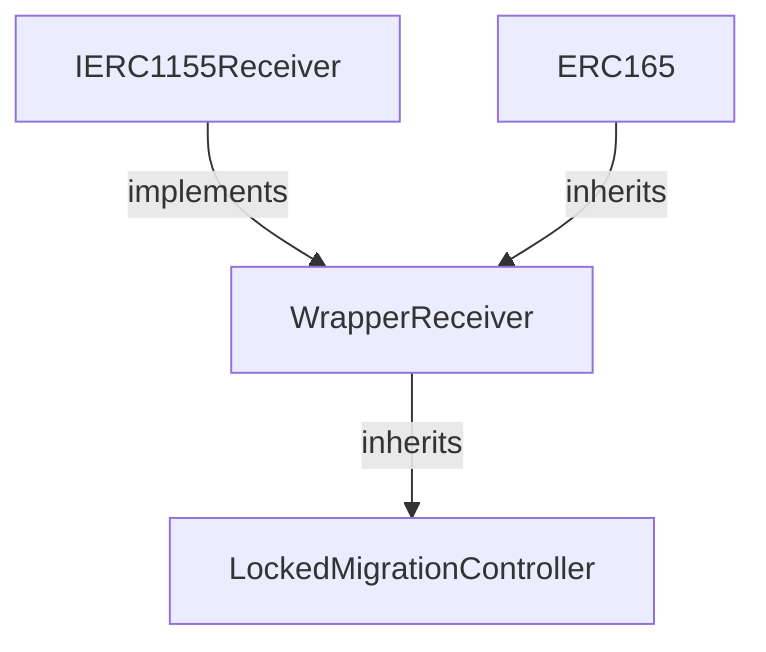

## Overview

The `LockedMigrationController` handles migration of locked .eth second-level domain (2LD) names from the ENS v1 NameWrapper to the v2 registry system. Locked names are those with the `CANNOT_UNWRAP` fuse set, indicating permanent commitment to the wrapped state.

<Info>
**Contract Location**: `contracts/src/migration/LockedMigrationController.sol`

Inherits from `WrapperReceiver` to handle ERC1155 token transfers and migration logic.
</Info>

## Architecture

### Inheritance Structure



### Key Components

<AccordionGroup>
  <Accordion title="WrapperReceiver (Base Contract)" icon="inbox">
    Provides the core migration functionality:
    - ERC1155 receiver implementation
    - Fuse to role translation logic
    - Subregistry deployment via VerifiableFactory
    - Migration data validation
    - Batch migration support
  </Accordion>
  
  <Accordion title="VerifiableFactory" icon="industry">
    Deploys deterministic subregistry contracts:
    - CREATE2 deployment for predictable addresses
    - Verification of deployment bytecode
    - Initialization with migration parameters
  </Accordion>
  
  <Accordion title="ETH Registry" icon="database">
    Target registry for v2 names:
    - Permissioned registration system
    - Role-based access control
    - Hierarchical subregistry support
  </Accordion>
</AccordionGroup>

## Contract Interface

### Constructor

```solidity
constructor(
    IPermissionedRegistry ethRegistry,
    INameWrapper nameWrapper,
    VerifiableFactory verifiableFactory,
    address wrapperRegistryImpl
)
```

**Parameters:**

- `ethRegistry`: The v2 ETH Registry contract
- `nameWrapper`: The v1 NameWrapper contract
- `verifiableFactory`: Factory for deploying WrapperRegistry subregistries
- `wrapperRegistryImpl`: Implementation contract for WrapperRegistry proxies

### Immutable State

```solidity
IPermissionedRegistry public immutable ETH_REGISTRY;
INameWrapper public immutable NAME_WRAPPER;
VerifiableFactory public immutable VERIFIABLE_FACTORY;
address public immutable WRAPPER_REGISTRY_IMPL;
```

## Migration Process

### Step-by-Step Flow

<Steps>
  <Step title="Pre-Migration: Reserve Names">
    Names must be marked as `RESERVED` in the v2 ETH Registry before migration. This prevents registration through other flows.
    
    ```solidity
    // Performed by admin with ROLE_REGISTER_RESERVED
    ethRegistry.setReserved(labelHash, true);
    ```
  </Step>
  
  <Step title="Prepare Migration Data">
    Encode the migration data for the name:
    
    ```solidity
    IWrapperRegistry.Data memory data = IWrapperRegistry.Data({
        label: "myname",
        owner: ownerAddress,
        resolver: resolverAddress,
        salt: saltValue
    });
    
    bytes memory encodedData = abi.encode(data);
    ```
  </Step>
  
  <Step title="Transfer to Controller">
    Transfer the locked name to the `LockedMigrationController`:
    
    ```solidity
    nameWrapper.safeTransferFrom(
        msg.sender,
        address(lockedMigrationController),
        tokenId,
        1,
        encodedData
    );
    ```
  </Step>
  
  <Step title="Controller Receives Token">
    The `onERC1155Received()` hook is triggered, starting the migration process.
  </Step>
  
  <Step title="Validate Migration Data">
    Controller validates:
    - Token ID matches computed namehash
    - Name is locked (`CANNOT_UNWRAP` set)
    - Owner is not zero address
    - Name is not expired
  </Step>
  
  <Step title="Deploy Subregistry">
    A `WrapperRegistry` is deployed deterministically:
    
    ```solidity
    IRegistry subregistry = IRegistry(
        VERIFIABLE_FACTORY.deployProxy(
            WRAPPER_REGISTRY_IMPL,
            salt,
            initData
        )
    );
    ```
  </Step>
  
  <Step title="Translate Fuses to Roles">
    v1 fuses are converted to v2 role bitmaps for both token and subregistry.
  </Step>
  
  <Step title="Register in v2">
    Name is registered in the ETH Registry:
    
    ```solidity
    ETH_REGISTRY.register(
        label,
        owner,
        subregistry,
        resolver,
        roleBitmap,
        0  // expiry (ignored for reserved names)
    );
    ```
  </Step>
  
  <Step title="Burn Migration Fuses">
    If fuses aren't frozen, migration-specific fuses are burned on the v1 token.
  </Step>
</Steps>

## Fuse Translation

The migration translates v1 fuses to v2 roles through the `_generateRoleBitmapsFromFuses()` function:

### Token Roles (Parent Registry Permissions)

<CodeGroup>
```solidity Renewal Permissions
if ((fuses & CAN_EXTEND_EXPIRY) != 0) {
    tokenRoles |= ROLE_RENEW;
    if (!fusesFrozen) {
        tokenRoles |= ROLE_RENEW_ADMIN;
    }
}
```

```solidity Resolver Permissions
if ((fuses & CANNOT_SET_RESOLVER) == 0) {
    tokenRoles |= ROLE_SET_RESOLVER;
    if (!fusesFrozen) {
        tokenRoles |= ROLE_SET_RESOLVER_ADMIN;
    }
}
```

```solidity Transfer Permissions
if ((fuses & CANNOT_TRANSFER) == 0) {
    tokenRoles |= ROLE_CAN_TRANSFER_ADMIN;
}
```
</CodeGroup>

### Subregistry Roles (Child Registry Permissions)

<CodeGroup>
```solidity Subdomain Creation
if ((fuses & CANNOT_CREATE_SUBDOMAIN) == 0) {
    registryRoles |= ROLE_REGISTRAR;
    if (!fusesFrozen) {
        registryRoles |= ROLE_REGISTRAR_ADMIN;
    }
}
```

```solidity Default Renewal
// Always granted for subregistry
registryRoles |= ROLE_RENEW;
registryRoles |= ROLE_RENEW_ADMIN;
```
</CodeGroup>

<Note>
**Fuses Frozen**: When `CANNOT_BURN_FUSES` is set, admin roles are not granted, making permissions permanent.
</Note>

## Resolver Handling

The migration intelligently handles resolver configuration:

```solidity
if ((fuses & CANNOT_SET_RESOLVER) != 0) {
    // Resolver is locked, preserve it
    data.resolver = NAME_WRAPPER.ens().resolver(node);
} else {
    // Resolver is mutable, clear it
    NAME_WRAPPER.setResolver(node, address(0));
}
```

<AccordionGroup>
  <Accordion title="Locked Resolver (CANNOT_SET_RESOLVER set)">
    - Current v1 resolver address is read from the registry
    - Resolver address is transferred to v2 registration
    - Ensures continuity of name resolution
  </Accordion>
  
  <Accordion title="Unlocked Resolver (CANNOT_SET_RESOLVER not set)">
    - v1 resolver is cleared to prevent confusion
    - v2 owner can set their own resolver
    - Grants `ROLE_SET_RESOLVER` and `ROLE_SET_RESOLVER_ADMIN`
  </Accordion>
</AccordionGroup>

## Subregistry Deployment

### CREATE2 Deployment

Subregistries are deployed deterministically using CREATE2:

```solidity
address predictedAddress = VERIFIABLE_FACTORY.computeProxyAddress(
    WRAPPER_REGISTRY_IMPL,
    salt
);

IRegistry subregistry = IRegistry(
    VERIFIABLE_FACTORY.deployProxy(
        WRAPPER_REGISTRY_IMPL,
        salt,
        abi.encodeCall(
            IWrapperRegistry.initialize,
            IWrapperRegistry.ConstructorArgs({
                node: node,
                owner: owner,
                ownerRoles: registryRoles
            })
        )
    )
);
```

### Benefits of Deterministic Deployment

<CardGroup cols={2}>
  <Card title="Predictable Addresses" icon="location-dot">
    Subregistry addresses can be computed off-chain before deployment.
  </Card>
  
  <Card title="Verifiable Bytecode" icon="shield-check">
    VerifiableFactory ensures deployed bytecode matches expected implementation.
  </Card>
  
  <Card title="No Duplicate Deployments" icon="copy">
    CREATE2 prevents deploying the same subregistry twice.
  </Card>
  
  <Card title="Cross-Chain Consistency" icon="globe">
    Same salt produces same address across different chains.
  </Card>
</CardGroup>

## Security Guarantees

<Warning>
**Critical Requirements:**

1. Controller must have `ROLE_REGISTER_RESERVED` on ETH Registry
2. Names must be pre-reserved before migration
3. Only locked names (`CANNOT_UNWRAP` set) are accepted
4. Token ID must match computed namehash
</Warning>

### Validation Checks

<AccordionGroup>
  <Accordion title="Caller Authorization" icon="user-shield">
    ```solidity
    modifier onlyWrapper() {
        if (msg.sender != address(NAME_WRAPPER)) {
            revert UnauthorizedCaller(msg.sender);
        }
        _;
    }
    ```
    Only the NameWrapper can trigger migration.
  </Accordion>
  
  <Accordion title="Lock Verification" icon="lock">
    ```solidity
    if ((fuses & CANNOT_UNWRAP) == 0) {
        revert NameNotLocked(uint256(node));
    }
    ```
    Ensures only locked names are migrated through this controller.
  </Accordion>
  
  <Accordion title="Namehash Validation" icon="hashtag">
    ```solidity
    bytes32 node = bytes32(ids[i]);
    bytes32 labelHash = keccak256(bytes(data.label));
    if (node != NameCoder.namehash(parentNode, labelHash)) {
        revert NameDataMismatch(uint256(node));
    }
    ```
    Prevents name mismatch attacks.
  </Accordion>
  
  <Accordion title="Owner Validation" icon="user">
    ```solidity
    if (data.owner == address(0)) {
        revert ERC1155InvalidReceiver(data.owner);
    }
    ```
    Ensures valid owner address.
  </Accordion>
  
  <Accordion title="Expiry Check" icon="clock">
    ```solidity
    assert(expiry >= block.timestamp);
    ```
    Expired names cannot be transferred by NameWrapper.
  </Accordion>
</AccordionGroup>

## Batch Migration

Migrate multiple locked names in a single transaction:

```solidity
// Prepare migration data for multiple names
IWrapperRegistry.Data[] memory dataArray = new IWrapperRegistry.Data[](3);
dataArray[0] = IWrapperRegistry.Data("alice", aliceOwner, aliceResolver, salt1);
dataArray[1] = IWrapperRegistry.Data("bob", bobOwner, bobResolver, salt2);
dataArray[2] = IWrapperRegistry.Data("charlie", charlieOwner, charlieResolver, salt3);

uint256[] memory tokenIds = new uint256[](3);
tokenIds[0] = uint256(keccak256("alice"));
tokenIds[1] = uint256(keccak256("bob"));
tokenIds[2] = uint256(keccak256("charlie"));

uint256[] memory amounts = new uint256[](3);
amounts[0] = amounts[1] = amounts[2] = 1;

// Batch transfer
nameWrapper.safeBatchTransferFrom(
    msg.sender,
    address(lockedMigrationController),
    tokenIds,
    amounts,
    abi.encode(dataArray)
);
```

<Tip>
**Gas Savings**: Batch migration can save significant gas compared to individual transfers, especially for the ERC1155 transfer overhead.
</Tip>

## Migration Data Structure

### IWrapperRegistry.Data

```solidity
struct Data {
    string label;       // Name label (e.g., "myname" for myname.eth)
    address owner;      // Owner address in v2
    address resolver;   // Resolver address (may be overridden)
    uint256 salt;       // CREATE2 salt for subregistry deployment
}
```

### Field Details

<AccordionGroup>
  <Accordion title="label">
    **Type**: `string`
    
    The first label of the name being migrated. For "myname.eth", this is "myname".
    
    **Constraints**:
    - Length must be 1-255 bytes
    - Must match the token ID being transferred
  </Accordion>
  
  <Accordion title="owner">
    **Type**: `address`
    
    The owner of the name in the v2 system.
    
    **Constraints**:
    - Cannot be zero address
    - Receives all granted roles
  </Accordion>
  
  <Accordion title="resolver">
    **Type**: `address`
    
    Resolver address for the name.
    
    **Behavior**:
    - If `CANNOT_SET_RESOLVER` is set: v1 resolver is used regardless of this value
    - If `CANNOT_SET_RESOLVER` is not set: This value is used as the resolver
  </Accordion>
  
  <Accordion title="salt">
    **Type**: `uint256`
    
    Salt value for CREATE2 deployment of the WrapperRegistry subregistry.
    
    **Usage**:
    - Enables deterministic subregistry addresses
    - Should be unique per name to avoid deployment conflicts
    - Can be zero for simple deployments
  </Accordion>
</AccordionGroup>

## Error Reference

### LockedMigrationController Errors

<ResponseField name="UnauthorizedCaller(address caller)" type="error">
  Transfer not initiated by the NameWrapper contract.
  
  **Solution**: Only transfer through `NameWrapper.safeTransferFrom()`
</ResponseField>

<ResponseField name="NameNotLocked(uint256 tokenId)" type="error">
  Name doesn't have `CANNOT_UNWRAP` fuse set.
  
  **Solution**: Use `UnlockedMigrationController` instead
</ResponseField>

<ResponseField name="NameDataMismatch(uint256 tokenId)" type="error">
  Token ID doesn't match computed namehash from label.
  
  **Solution**: Verify label is correct for the token being migrated
</ResponseField>

<ResponseField name="ERC1155InvalidReceiver(address receiver)" type="error">
  Owner address is zero address.
  
  **Solution**: Provide valid owner address
</ResponseField>

<ResponseField name="InvalidData()" type="error">
  Migration data is too small or malformed.
  
  
  **Solution**: Ensure data is properly ABI-encoded
</ResponseField>

## Example: Complete Migration

```solidity
// SPDX-License-Identifier: MIT
pragma solidity ^0.8.13;

import {INameWrapper} from "@ens/contracts/wrapper/INameWrapper.sol";
import {IWrapperRegistry} from "./interfaces/IWrapperRegistry.sol";
import {LockedMigrationController} from "./LockedMigrationController.sol";

contract MigrationExample {
    INameWrapper public immutable nameWrapper;
    LockedMigrationController public immutable controller;
    
    constructor(address _nameWrapper, address _controller) {
        nameWrapper = INameWrapper(_nameWrapper);
        controller = LockedMigrationController(_controller);
    }
    
    function migrateLockedName(
        string calldata label,
        address newOwner,
        address resolver,
        uint256 salt
    ) external {
        // Compute token ID
        uint256 tokenId = uint256(keccak256(bytes(label)));
        
        // Verify caller owns the name
        require(
            nameWrapper.ownerOf(tokenId) == msg.sender,
            "Not owner"
        );
        
        // Verify name is locked
        (, uint32 fuses, ) = nameWrapper.getData(tokenId);
        require(
            fuses & CANNOT_UNWRAP != 0,
            "Name not locked"
        );
        
        // Prepare migration data
        IWrapperRegistry.Data memory data = IWrapperRegistry.Data({
            label: label,
            owner: newOwner,
            resolver: resolver,
            salt: salt
        });
        
        // Transfer to controller (triggers migration)
        nameWrapper.safeTransferFrom(
            msg.sender,
            address(controller),
            tokenId,
            1,
            abi.encode(data)
        );
    }
}
```

## Best Practices

<CardGroup cols={2}>
  <Card title="Verify Lock Status" icon="shield-check">
    Always verify `CANNOT_UNWRAP` is set before using locked migration.
  </Card>
  
  <Card title="Choose Salt Carefully" icon="dice">
    Use unique, deterministic salt values for predictable subregistry addresses.
  </Card>
  
  <Card title="Pre-Reserve Names" icon="bookmark">
    Ensure names are reserved in v2 registry before migration.
  </Card>
  
  <Card title="Test on Testnet" icon="flask">
    Test migration process on testnet before migrating mainnet names.
  </Card>
  
  <Card title="Verify Roles" icon="user-shield">
    Check resulting role bitmap matches expected permissions.
  </Card>
  
  <Card title="Batch When Possible" icon="layer-group">
    Use batch transfers for multiple names to save gas.
  </Card>
</CardGroup>

## Related Documentation

<CardGroup cols={2}>
  <Card title="Migration Overview" icon="arrow-right-arrow-left" href="/migration/overview">
    Understand the complete migration system
  </Card>
  <Card title="Unlocked Migration" icon="lock-open" href="/migration/unlocked-migration">
    Learn about unlocked name migration
  </Card>
  <Card title="Access Control" icon="shield" href="/access-control/overview">
    Understand v2 role-based permissions
  </Card>
  <Card title="Wrapper Registry" icon="box" href="/registry/wrapper-registry">
    Learn about the WrapperRegistry subregistry
  </Card>
</CardGroup>