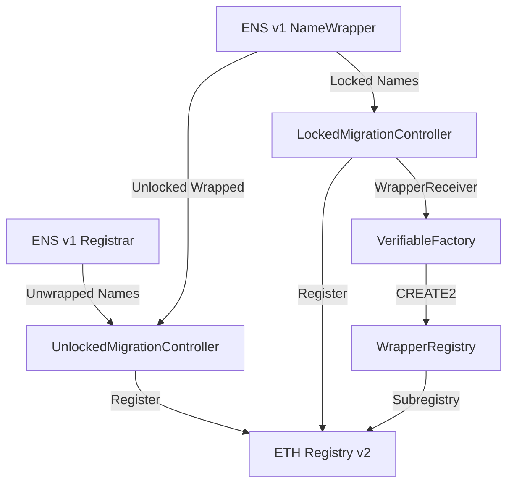

## Introduction

The ENS v2 migration system enables seamless transition of names from the ENS v1 NameWrapper to the new v2 registry architecture. The migration process preserves ownership, configuration, and permissions while upgrading to the enhanced v2 system.

<Info>
Migration is a one-way process. Once a name is migrated to v2, it cannot be reverted to v1.
</Info>

## Migration Types

ENS v2 provides two distinct migration controllers based on the locked state of names:

<CardGroup cols={2}>
  <Card title="Locked Migration" icon="lock" href="/migration/locked-migration">
    For .eth 2LD names with `CANNOT_UNWRAP` fuse set (locked names)
  </Card>
  <Card title="Unlocked Migration" icon="lock-open" href="/migration/unlocked-migration">
    For unwrapped .eth 2LD names and wrapped names without `CANNOT_UNWRAP`
  </Card>
</CardGroup>

## Key Differences

### Locked vs Unlocked Migration

| Aspect | Locked Migration | Unlocked Migration |
|--------|-----------------|--------------------|
| **Target Names** | Wrapped .eth 2LDs with `CANNOT_UNWRAP` | Unwrapped .eth 2LDs or wrapped without lock |
| **Controller** | `LockedMigrationController` | `UnlockedMigrationController` |
| **Fuse Translation** | Converts fuses to v2 roles | N/A |
| **Subregistry** | Creates `WrapperRegistry` via factory | Standard registration |
| **Transfer Method** | ERC1155 `safeTransferFrom` | ERC721/ERC1155 transfer |
| **Pre-migration** | Requires name to be `RESERVED` | Direct registration |

## Migration Architecture

### Component Overview



### Core Components

<AccordionGroup>
  <Accordion title="LockedMigrationController" icon="lock">
    Handles migration of locked .eth 2LD names from the NameWrapper. Inherits from `WrapperReceiver` to:
    - Receive ERC1155 transfers from NameWrapper
    - Translate v1 fuses to v2 role bitmaps
    - Deploy deterministic `WrapperRegistry` subregistries
    - Register names in the ETH Registry with `RESERVED` permission
  </Accordion>
  
  <Accordion title="UnlockedMigrationController" icon="lock-open">
    Handles migration of unlocked names (both wrapped and unwrapped). Features:
    - Accepts ERC721 transfers from the v1 Registrar (unwrapped names)
    - Accepts ERC1155 transfers from NameWrapper (unlocked wrapped names)
    - Unwraps locked names before migration
    - Registers names directly in ETH Registry v2
  </Accordion>
  
  <Accordion title="WrapperReceiver" icon="inbox">
    Abstract base contract providing ERC1155 receiver functionality for migration:
    - Implements `IERC1155Receiver` interface
    - Handles single and batch token transfers
    - Validates migration data against token IDs
    - Translates v1 fuses to v2 role bitmaps
    - Deploys subregistries via `VerifiableFactory`
  </Accordion>
</AccordionGroup>

## Migration Process Flow

### Locked Name Migration

<Steps>
  <Step title="Prepare Migration Data">
    Encode migration data including label, owner, resolver, and salt for CREATE2 deployment.
  </Step>
  <Step title="Transfer to Controller">
    Call `NameWrapper.safeTransferFrom()` sending the locked name to `LockedMigrationController` with migration data.
  </Step>
  <Step title="Receive and Validate">
    Controller receives token via `onERC1155Received()`, validates the data matches the token ID.
  </Step>
  <Step title="Deploy Subregistry">
    `VerifiableFactory` creates a deterministic `WrapperRegistry` using CREATE2 with the provided salt.
  </Step>
  <Step title="Translate Fuses">
    Convert v1 fuses to v2 role bitmaps for both token roles and subregistry roles.
  </Step>
  <Step title="Register in v2">
    Call `ETH_REGISTRY.register()` with the new owner, subregistry, resolver, and roles.
  </Step>
  <Step title="Burn Migration Fuses">
    If fuses not frozen, burn migration-specific fuses on the v1 token.
  </Step>
</Steps>

### Unlocked Name Migration

<Steps>
  <Step title="Prepare Migration Data">
    Create `MigrationData` with transfer details (name, owner, resolver, roles, expiry).
  </Step>
  <Step title="Transfer to Controller">
    For unwrapped names: Transfer ERC721 from v1 Registrar.
    For wrapped unlocked: Transfer ERC1155 from NameWrapper.
  </Step>
  <Step title="Unwrap if Needed">
    If name is wrapped but unlocked, controller calls `unwrapETH2LD()` first.
  </Step>
  <Step title="Validate Token ID">
    Verify token ID matches the label hash from the encoded name.
  </Step>
  <Step title="Register in v2">
    Call `ETH_REGISTRY.register()` with migration data to create v2 registration.
  </Step>
</Steps>

## Fuse to Role Translation

The migration process converts ENS v1 fuses to ENS v2 role-based permissions:

### Token Roles (Parent Registry)

| v1 Fuse | v2 Role | Admin Role |
|---------|---------|------------|
| `CAN_EXTEND_EXPIRY` | `ROLE_RENEW` | `ROLE_RENEW_ADMIN` |
| Not `CANNOT_SET_RESOLVER` | `ROLE_SET_RESOLVER` | `ROLE_SET_RESOLVER_ADMIN` |
| Not `CANNOT_TRANSFER` | `ROLE_CAN_TRANSFER_ADMIN` | - |

### Subregistry Roles (Child Registry)

| v1 Fuse | v2 Role | Admin Role |
|---------|---------|------------|
| Not `CANNOT_CREATE_SUBDOMAIN` | `ROLE_REGISTRAR` | `ROLE_REGISTRAR_ADMIN` |
| Always granted | `ROLE_RENEW` | `ROLE_RENEW_ADMIN` |

<Note>
Admin roles are only granted if `CANNOT_BURN_FUSES` is not set, allowing future permission modifications.
</Note>

## Migration Data Structures

### TransferData

Contains the core migration information:

```solidity
struct TransferData {
    bytes dnsEncodedName;   // DNS-encoded name (e.g., "\x04nick\x03eth\x00")
    address owner;          // New owner in v2
    address subregistry;    // Subregistry contract (can be zero)
    address resolver;       // Resolver address
    uint256 roleBitmap;     // Role permissions bitmap
    uint64 expires;         // Expiration timestamp
}
```

### MigrationData

Extends `TransferData` with deployment parameters:

```solidity
struct MigrationData {
    TransferData transferData;  // Core transfer data
    uint256 salt;              // CREATE2 salt for deterministic deployment
}
```

## Security Considerations

<Warning>
**Critical Security Requirements:**

- Only locked names with `CANNOT_UNWRAP` are accepted by `LockedMigrationController`
- Token ID must match the label hash to prevent name mismatch attacks
- Owner cannot be zero address (enforced by ERC1155 standard)
- Expired names cannot be transferred (enforced by NameWrapper)
- `LockedMigrationController` requires `ROLE_REGISTER_RESERVED` permission
</Warning>

### Validation Checks

The migration controllers perform strict validation:

1. **Caller Authorization**: Only NameWrapper or Registrar can trigger migration
2. **Token ID Verification**: `namehash(parentNode, labelHash)` must equal token ID
3. **Lock Status**: Locked migration requires `CANNOT_UNWRAP` fuse
4. **Owner Validation**: Owner address cannot be zero
5. **Expiry Check**: Name must not be expired
6. **Data Size**: Migration data must meet minimum size requirements

## Reserved Names

For locked migration, names must be pre-reserved in the v2 ETH Registry:

<Info>
The `RESERVED` status ensures names cannot be registered through normal registration flows before migration completes.
</Info>

### Reservation Process

1. Administrator marks names as `RESERVED` in ETH Registry v2
2. Locked migration can register reserved names
3. Attempting to register reserved names through other flows reverts

## Batch Migration

Both controllers support batch migration for gas efficiency:

```solidity
// Batch migrate multiple locked names
NameWrapper.safeBatchTransferFrom(
    owner,
    lockedMigrationController,
    tokenIds,
    amounts,
    abi.encode(migrationDataArray)
);
```

<Tip>
Batch migration is more gas-efficient when migrating multiple names. The ERC1155 batch transfer reduces overhead compared to individual transfers.
</Tip>

## Error Handling

Common migration errors:

<AccordionGroup>
  <Accordion title="UnauthorizedCaller(address caller)">
    **Cause**: Transfer not from NameWrapper or Registrar
    
    **Solution**: Use the correct transfer function from the appropriate contract
  </Accordion>
  
  <Accordion title="NameNotLocked(uint256 tokenId)">
    **Cause**: Attempting locked migration on unlocked name
    
    **Solution**: Use `UnlockedMigrationController` instead
  </Accordion>
  
  <Accordion title="NameDataMismatch(uint256 tokenId)">
    **Cause**: Token ID doesn't match computed namehash
    
    **Solution**: Verify label and parent node are correct
  </Accordion>
  
  <Accordion title="TokenIdMismatch(uint256 tokenId, uint256 expectedTokenId)">
    **Cause**: Token ID doesn't match label hash in migration data
    
    **Solution**: Ensure DNS-encoded name matches the token being migrated
  </Accordion>
  
  <Accordion title="MigrationNotSupported()">
    **Cause**: Unlocked controller received a locked name
    
    **Solution**: Use `LockedMigrationController` for locked names
  </Accordion>
  
  <Accordion title="InvalidData()">
    **Cause**: Migration data too small or malformed
    
    **Solution**: Ensure data is properly ABI-encoded with required fields
  </Accordion>
</AccordionGroup>

## Post-Migration State

After successful migration:

<Accordion title="For Locked Names">
  - Name registered in ETH Registry v2 with owner and roles
  - Subregistry bound to deterministic `WrapperRegistry`
  - v1 fuses translated to v2 role permissions
  - Migration-specific fuses burned on v1 token (if not frozen)
  - Resolver transferred or cleared based on `CANNOT_SET_RESOLVER`
  - Original v1 token remains in controller
</Accordion>

<Accordion title="For Unlocked Names">
  - Name registered in ETH Registry v2 with specified configuration
  - Subregistry and resolver set according to migration data
  - Expiry timestamp preserved from v1
  - Original v1 token (ERC721 or ERC1155) held by controller
</Accordion>

## Best Practices

<CardGroup cols={2}>
  <Card title="Verify Lock Status" icon="check">
    Always check if a name is locked before choosing the migration controller.
  </Card>
  
  <Card title="Use Deterministic Salts" icon="dice">
    Choose salt values carefully for predictable subregistry addresses.
  </Card>
  
  <Card title="Preserve Resolver" icon="server">
    Ensure resolver addresses are correct in migration data to maintain name resolution.
  </Card>
  
  <Card title="Batch When Possible" icon="layer-group">
    Use batch transfers for multiple names to save gas.
  </Card>
  
  <Card title="Test First" icon="flask">
    Test migration on testnet before migrating valuable names.
  </Card>
  
  <Card title="Verify Roles" icon="user-shield">
    Confirm role bitmaps grant expected permissions after migration.
  </Card>
</CardGroup>

## Next Steps

<CardGroup cols={2}>
  <Card title="Locked Migration" icon="lock" href="/migration/locked-migration">
    Learn about migrating locked .eth 2LD names
  </Card>
  <Card title="Unlocked Migration" icon="lock-open" href="/migration/unlocked-migration">
    Learn about migrating unlocked names
  </Card>
</CardGroup>