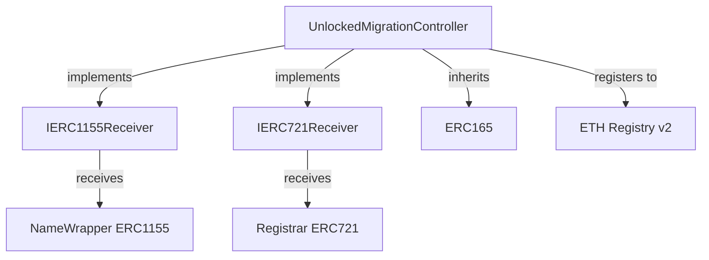

## Overview

The `UnlockedMigrationController` handles migration of unlocked .eth second-level domain (2LD) names from ENS v1 to the v2 registry system. This includes both unwrapped names (ERC721 tokens from the Registrar) and wrapped names without the `CANNOT_UNWRAP` fuse set.

<Info>
**Contract Location**: `contracts/src/migration/UnlockedMigrationController.sol`

Implements `IERC1155Receiver` and `IERC721Receiver` to accept transfers from both NameWrapper and Registrar.
</Info>

## Supported Name Types

The controller handles two categories of unlocked names:

<CardGroup cols={2}>
  <Card title="Unwrapped Names" icon="certificate">
    ERC721 tokens held in the v1 Base Registrar, never wrapped in NameWrapper.
  </Card>
  <Card title="Unlocked Wrapped Names" icon="gift">
    ERC1155 tokens in NameWrapper without `CANNOT_UNWRAP` fuse, allowing unwrapping.
  </Card>
</CardGroup>

## Architecture

### Interface Implementation



### Key Components

<AccordionGroup>
  <Accordion title="IERC1155Receiver" icon="inbox">
    Handles wrapped name transfers from NameWrapper:
    - `onERC1155Received()`: Single name transfer
    - `onERC1155BatchReceived()`: Batch name transfer
    - Validates sender is NameWrapper
    - Unwraps names before migration
  </Accordion>
  
  <Accordion title="IERC721Receiver" icon="image">
    Handles unwrapped name transfers from Registrar:
    - `onERC721Received()`: Single name transfer
    - Validates sender is the Base Registrar
    - Directly migrates without unwrapping
  </Accordion>
  
  <Accordion title="ETH Registry" icon="database">
    Target registry for v2 names:
    - Direct registration without reserved status
    - Accepts full configuration in migration data
    - No subregistry deployment needed
  </Accordion>
</AccordionGroup>

## Contract Interface

### Constructor

```solidity
constructor(
    INameWrapper nameWrapper,
    IPermissionedRegistry ethRegistry
)
```

**Parameters:**

- `nameWrapper`: The v1 NameWrapper contract
- `ethRegistry`: The v2 ETH Registry contract

### Immutable State

```solidity
INameWrapper public immutable NAME_WRAPPER;
IPermissionedRegistry public immutable ETH_REGISTRY;
```

### Interface Support

```solidity
function supportsInterface(bytes4 interfaceId) public view returns (bool) {
    return
        interfaceId == type(IERC1155Receiver).interfaceId ||
        interfaceId == type(IERC721Receiver).interfaceId ||
        super.supportsInterface(interfaceId);
}
```

## Migration Flows

### Unwrapped Name Migration (ERC721)

<Steps>
  <Step title="Prepare Migration Data">
    Create `MigrationData` with transfer details:
    
    ```solidity
    MigrationData memory data = MigrationData({
        transferData: TransferData({
            dnsEncodedName: dnsEncode("myname.eth"),
            owner: newOwner,
            subregistry: address(0),  // Can specify custom subregistry
            resolver: resolverAddress,
            roleBitmap: desiredRoles,
            expires: expiryTimestamp
        }),
        salt: 0  // Not used for unlocked migration
    });
    ```
  </Step>
  
  <Step title="Transfer ERC721 to Controller">
    Transfer the name from the Registrar:
    
    ```solidity
    registrar.safeTransferFrom(
        msg.sender,
        address(unlockedMigrationController),
        tokenId,
        abi.encode(data)
    );
    ```
  </Step>
  
  <Step title="Receive Hook Triggered">
    `onERC721Received()` is called by the Registrar.
  </Step>
  
  <Step title="Validate Caller">
    Verify transfer is from the Base Registrar:
    
    ```solidity
    if (msg.sender != address(NAME_WRAPPER.registrar())) {
        revert UnauthorizedCaller(msg.sender);
    }
    ```
  </Step>
  
  <Step title="Validate Token ID">
    Ensure token ID matches label hash:
    
    ```solidity
    (bytes32 labelHash, ) = NameCoder.readLabel(dnsEncodedName, 0);
    if (tokenId != uint256(labelHash)) {
        revert TokenIdMismatch(tokenId, uint256(labelHash));
    }
    ```
  </Step>
  
  <Step title="Register in v2">
    Call ETH Registry to register:
    
    ```solidity
    ETH_REGISTRY.register(
        label,
        owner,
        IRegistry(subregistry),
        resolver,
        roleBitmap,
        expires
    );
    ```
  </Step>
</Steps>

### Wrapped Unlocked Name Migration (ERC1155)

<Steps>
  <Step title="Prepare Migration Data">
    Same as unwrapped migration - create `MigrationData` struct.
  </Step>
  
  <Step title="Transfer ERC1155 to Controller">
    Transfer from NameWrapper:
    
    ```solidity
    nameWrapper.safeTransferFrom(
        msg.sender,
        address(unlockedMigrationController),
        tokenId,
        1,
        abi.encode(data)
    );
    ```
  </Step>
  
  <Step title="Receive Hook Triggered">
    `onERC1155Received()` or `onERC1155BatchReceived()` is called.
  </Step>
  
  <Step title="Validate Caller">
    Verify transfer is from NameWrapper:
    
    ```solidity
    if (msg.sender != address(NAME_WRAPPER)) {
        revert UnauthorizedCaller(msg.sender);
    }
    ```
  </Step>
  
  <Step title="Check Lock Status">
    Verify name is unlocked:
    
    ```solidity
    (, uint32 fuses, ) = NAME_WRAPPER.getData(tokenId);
    if (fuses & CANNOT_UNWRAP != 0) {
        revert MigrationNotSupported();
    }
    ```
  </Step>
  
  <Step title="Unwrap Name">
    Controller unwraps the name to itself:
    
    ```solidity
    bytes32 labelHash = bytes32(tokenId);
    NAME_WRAPPER.unwrapETH2LD(labelHash, address(this), address(this));
    ```
  </Step>
  
  <Step title="Validate and Register">
    Same validation and registration as unwrapped flow.
  </Step>
</Steps>

## Migration Data Structures

### TransferData

Contains the complete registration information:

```solidity
struct TransferData {
    bytes dnsEncodedName;   // DNS wire format (e.g., "\x06myname\x03eth\x00")
    address owner;          // Owner in v2 system
    address subregistry;    // Subregistry contract (0x0 for none)
    address resolver;       // Resolver address
    uint256 roleBitmap;     // Permission roles bitmap
    uint64 expires;         // Expiration timestamp
}
```

<AccordionGroup>
  <Accordion title="dnsEncodedName">
    **Type**: `bytes`
    
    DNS wire format encoding of the name:
    - First byte: label length
    - Next N bytes: label characters
    - Continues for each label
    - Terminates with 0x00
    
    **Example**: "myname.eth" → `0x066d796e616d650365746800`
    - `0x06`: Length of "myname" (6)
    - `0x6d796e616d65`: "myname" in hex
    - `0x03`: Length of "eth" (3)
    - `0x657468`: "eth" in hex
    - `0x00`: Terminator
  </Accordion>
  
  <Accordion title="owner">
    **Type**: `address`
    
    Owner of the name in v2 system.
    
    **Constraints**:
    - Cannot be zero address
    - Receives roles specified in `roleBitmap`
  </Accordion>
  
  <Accordion title="subregistry">
    **Type**: `address`
    
    Optional subregistry contract.
    
    **Usage**:
    - `address(0)`: No subregistry, standard name
    - Custom address: Specific subregistry implementation
    - Unlike locked migration, no automatic deployment
  </Accordion>
  
  <Accordion title="resolver">
    **Type**: `address`
    
    Resolver contract for name resolution.
    
    **Usage**:
    - Can be any valid resolver
    - Owner needs `ROLE_SET_RESOLVER` to change later
  </Accordion>
  
  <Accordion title="roleBitmap">
    **Type**: `uint256`
    
    Bitmap of roles to grant the owner.
    
    **Common Roles**:
    - `ROLE_RENEW`: Can extend expiry
    - `ROLE_SET_RESOLVER`: Can change resolver
    - `ROLE_CAN_TRANSFER_ADMIN`: Can transfer name
    - `ROLE_REGISTRAR`: Can create subdomains (if has subregistry)
  </Accordion>
  
  <Accordion title="expires">
    **Type**: `uint64`
    
    Expiration timestamp (Unix time).
    
    **Constraints**:
    - Must be in the future
    - Should match or extend v1 expiry
  </Accordion>
</AccordionGroup>

### MigrationData

Wrapper for transfer data with optional salt:

```solidity
struct MigrationData {
    TransferData transferData;  // Core migration data
    uint256 salt;              // Unused for unlocked migration
}
```

<Note>
The `salt` field is present for consistency with locked migration but is not used by `UnlockedMigrationController`.
</Note>

## Batch Migration

Migrate multiple wrapped unlocked names in one transaction:

```solidity
// Prepare migration data array
MigrationData[] memory dataArray = new MigrationData[](3);

dataArray[0] = MigrationData({
    transferData: TransferData({
        dnsEncodedName: dnsEncode("alice.eth"),
        owner: aliceOwner,
        subregistry: address(0),
        resolver: aliceResolver,
        roleBitmap: aliceRoles,
        expires: aliceExpiry
    }),
    salt: 0
});

// ... set dataArray[1] and dataArray[2]

uint256[] memory tokenIds = new uint256[](3);
tokenIds[0] = uint256(keccak256("alice"));
tokenIds[1] = uint256(keccak256("bob"));
tokenIds[2] = uint256(keccak256("charlie"));

uint256[] memory amounts = new uint256[](3);
amounts[0] = amounts[1] = amounts[2] = 1;

// Batch transfer
nameWrapper.safeBatchTransferFrom(
    msg.sender,
    address(unlockedMigrationController),
    tokenIds,
    amounts,
    abi.encode(dataArray)
);
```

<Warning>
**Important**: Batch migration only works for wrapped names. Unwrapped ERC721 names must be migrated individually.
</Warning>

## Security Validations

### Caller Authorization

<CodeGroup>
```solidity NameWrapper Transfers
if (msg.sender != address(NAME_WRAPPER)) {
    revert UnauthorizedCaller(msg.sender);
}
```

```solidity Registrar Transfers
if (msg.sender != address(NAME_WRAPPER.registrar())) {
    revert UnauthorizedCaller(msg.sender);
}
```
</CodeGroup>

### Lock Status Verification

```solidity
(, uint32 fuses, ) = NAME_WRAPPER.getData(tokenId);

if (fuses & CANNOT_UNWRAP != 0) {
    // Name is locked - must use LockedMigrationController
    revert MigrationNotSupported();
}
```

<Info>
Locked names (with `CANNOT_UNWRAP`) are rejected. They must use `LockedMigrationController` instead.
</Info>

### Token ID Validation

```solidity
(bytes32 labelHash, ) = NameCoder.readLabel(dnsEncodedName, 0);

if (tokenId != uint256(labelHash)) {
    revert TokenIdMismatch(tokenId, uint256(labelHash));
}
```

This prevents:
- Migrating wrong name for a token
- Name/token mismatch attacks
- Data encoding errors

## Error Reference

<ResponseField name="UnauthorizedCaller(address caller)" type="error">
  **Selector**: `0x315ec9f5`
  
  Transfer not from NameWrapper or Registrar.
  
  **Solutions**:
  - Use `NameWrapper.safeTransferFrom()` for wrapped names
  - Use `Registrar.safeTransferFrom()` for unwrapped names
</ResponseField>

<ResponseField name="TokenIdMismatch(uint256 tokenId, uint256 expectedTokenId)" type="error">
  **Selector**: `0x4fa09b3f`
  
  Token ID doesn't match label hash from DNS-encoded name.
  
  **Solutions**:
  - Verify DNS encoding is correct
  - Ensure label matches the token being transferred
  - Check for encoding errors
</ResponseField>

<ResponseField name="MigrationNotSupported()" type="error">
  **Selector**: `0x80da7148`
  
  Attempted to migrate a locked name through unlocked controller.
  
  **Solution**: Use `LockedMigrationController` for locked names
</ResponseField>

## Complete Example

### Migrating an Unwrapped Name

```solidity
// SPDX-License-Identifier: MIT
pragma solidity ^0.8.13;

import {IBaseRegistrar} from "@ens/contracts/ethregistrar/IBaseRegistrar.sol";
import {NameCoder} from "@ens/contracts/utils/NameCoder.sol";
import {UnlockedMigrationController} from "./UnlockedMigrationController.sol";
import {MigrationData, TransferData} from "./types/MigrationTypes.sol";
import {RegistryRolesLib} from "../registry/libraries/RegistryRolesLib.sol";

contract UnwrappedMigrationExample {
    IBaseRegistrar public immutable registrar;
    UnlockedMigrationController public immutable controller;
    
    constructor(address _registrar, address _controller) {
        registrar = IBaseRegistrar(_registrar);
        controller = UnlockedMigrationController(_controller);
    }
    
    function migrateUnwrappedName(
        string calldata label,
        address newOwner,
        address resolver
    ) external {
        uint256 tokenId = uint256(keccak256(bytes(label)));
        
        // Verify ownership
        require(registrar.ownerOf(tokenId) == msg.sender, "Not owner");
        
        // Get expiry from registrar
        uint64 expires = uint64(registrar.nameExpires(tokenId));
        
        // Build DNS-encoded name
        bytes memory dnsName = NameCoder.dnsEncodeName(
            string(abi.encodePacked(label, ".eth"))
        );
        
        // Define roles for new owner
        uint256 roles = RegistryRolesLib.ROLE_RENEW |
                       RegistryRolesLib.ROLE_RENEW_ADMIN |
                       RegistryRolesLib.ROLE_SET_RESOLVER |
                       RegistryRolesLib.ROLE_SET_RESOLVER_ADMIN |
                       RegistryRolesLib.ROLE_CAN_TRANSFER_ADMIN;
        
        // Create migration data
        MigrationData memory data = MigrationData({
            transferData: TransferData({
                dnsEncodedName: dnsName,
                owner: newOwner,
                subregistry: address(0),
                resolver: resolver,
                roleBitmap: roles,
                expires: expires
            }),
            salt: 0
        });
        
        // Transfer to controller (triggers migration)
        registrar.safeTransferFrom(
            msg.sender,
            address(controller),
            tokenId,
            abi.encode(data)
        );
    }
}
```

### Migrating a Wrapped Unlocked Name

```solidity
// SPDX-License-Identifier: MIT
pragma solidity ^0.8.13;

import {INameWrapper, CANNOT_UNWRAP} from "@ens/contracts/wrapper/INameWrapper.sol";
import {NameCoder} from "@ens/contracts/utils/NameCoder.sol";
import {UnlockedMigrationController} from "./UnlockedMigrationController.sol";
import {MigrationData, TransferData} from "./types/MigrationTypes.sol";
import {RegistryRolesLib} from "../registry/libraries/RegistryRolesLib.sol";

contract WrappedUnlockedMigrationExample {
    INameWrapper public immutable nameWrapper;
    UnlockedMigrationController public immutable controller;
    
    constructor(address _nameWrapper, address _controller) {
        nameWrapper = INameWrapper(_nameWrapper);
        controller = UnlockedMigrationController(_controller);
    }
    
    function migrateWrappedUnlockedName(
        string calldata label,
        address newOwner,
        address resolver
    ) external {
        uint256 tokenId = uint256(keccak256(bytes(label)));
        
        // Verify ownership
        require(nameWrapper.ownerOf(tokenId) == msg.sender, "Not owner");
        
        // Verify name is unlocked
        (, uint32 fuses, uint64 expiry) = nameWrapper.getData(tokenId);
        require(
            (fuses & CANNOT_UNWRAP) == 0,
            "Name is locked, use LockedMigrationController"
        );
        
        // Build DNS-encoded name
        bytes memory dnsName = NameCoder.dnsEncodeName(
            string(abi.encodePacked(label, ".eth"))
        );
        
        // Define roles
        uint256 roles = RegistryRolesLib.ROLE_RENEW |
                       RegistryRolesLib.ROLE_RENEW_ADMIN |
                       RegistryRolesLib.ROLE_SET_RESOLVER |
                       RegistryRolesLib.ROLE_SET_RESOLVER_ADMIN |
                       RegistryRolesLib.ROLE_CAN_TRANSFER_ADMIN;
        
        // Create migration data
        MigrationData memory data = MigrationData({
            transferData: TransferData({
                dnsEncodedName: dnsName,
                owner: newOwner,
                subregistry: address(0),
                resolver: resolver,
                roleBitmap: roles,
                expires: expiry
            }),
            salt: 0
        });
        
        // Transfer to controller (triggers migration)
        nameWrapper.safeTransferFrom(
            msg.sender,
            address(controller),
            tokenId,
            1,
            abi.encode(data)
        );
    }
}
```

## Comparison with Locked Migration

| Feature | Unlocked Migration | Locked Migration |
|---------|-------------------|------------------|
| **Name State** | Unlocked or unwrapped | Locked with `CANNOT_UNWRAP` |
| **Token Type** | ERC721 or unlocked ERC1155 | Locked ERC1155 |
| **Unwrapping** | Automatic if wrapped | Not supported |
| **Subregistry** | Optional, user-specified | Automatic WrapperRegistry deployment |
| **Roles** | User-specified via `roleBitmap` | Translated from fuses |
| **Reservation** | Not required | Must be pre-reserved |
| **Complexity** | Simpler | More complex |
| **Use Case** | Standard names | Premium/locked names |

## Best Practices

<CardGroup cols={2}>
  <Card title="Verify Lock Status" icon="magnifying-glass">
    Always check `CANNOT_UNWRAP` before choosing controller.
  </Card>
  
  <Card title="Preserve Expiry" icon="clock">
    Use the current expiry from v1 to maintain registration period.
  </Card>
  
  <Card title="Set Appropriate Roles" icon="user-gear">
    Grant roles based on intended name usage and management needs.
  </Card>
  
  <Card title="Validate DNS Encoding" icon="check">
    Ensure DNS-encoded name is correctly formatted to avoid mismatches.
  </Card>
  
  <Card title="Test on Testnet" icon="vial">
    Test migration flow on testnet before migrating mainnet names.
  </Card>
  
  <Card title="Handle Both Types" icon="code-branch">
    Support both wrapped and unwrapped migrations in your integration.
  </Card>
</CardGroup>

## Common Patterns

### Helper: DNS Encoding

```solidity
function encodeDnsName(string memory label) internal pure returns (bytes memory) {
    return NameCoder.dnsEncodeName(
        string(abi.encodePacked(label, ".eth"))
    );
}
```

### Helper: Standard Roles

```solidity
function getStandardRoles() internal pure returns (uint256) {
    return RegistryRolesLib.ROLE_RENEW |
           RegistryRolesLib.ROLE_RENEW_ADMIN |
           RegistryRolesLib.ROLE_SET_RESOLVER |
           RegistryRolesLib.ROLE_SET_RESOLVER_ADMIN |
           RegistryRolesLib.ROLE_CAN_TRANSFER_ADMIN;
}
```

### Helper: Check Lock Status

```solidity
function isLocked(INameWrapper wrapper, uint256 tokenId) 
    internal 
    view 
    returns (bool) 
{
    (, uint32 fuses, ) = wrapper.getData(tokenId);
    return (fuses & CANNOT_UNWRAP) != 0;
}
```

## Related Documentation

<CardGroup cols={2}>
  <Card title="Migration Overview" icon="arrow-right-arrow-left" href="/migration/overview">
    Understand the complete migration system
  </Card>
  <Card title="Locked Migration" icon="lock" href="/migration/locked-migration">
    Learn about locked name migration
  </Card>
  <Card title="Registry Roles" icon="shield-halved" href="/access-control/registry-roles">
    Understand the role-based permission system
  </Card>
  <Card title="ETH Registrar" icon="file-signature" href="/registrar/eth-registrar">
    Learn about the v2 ETH Registrar
  </Card>
</CardGroup>