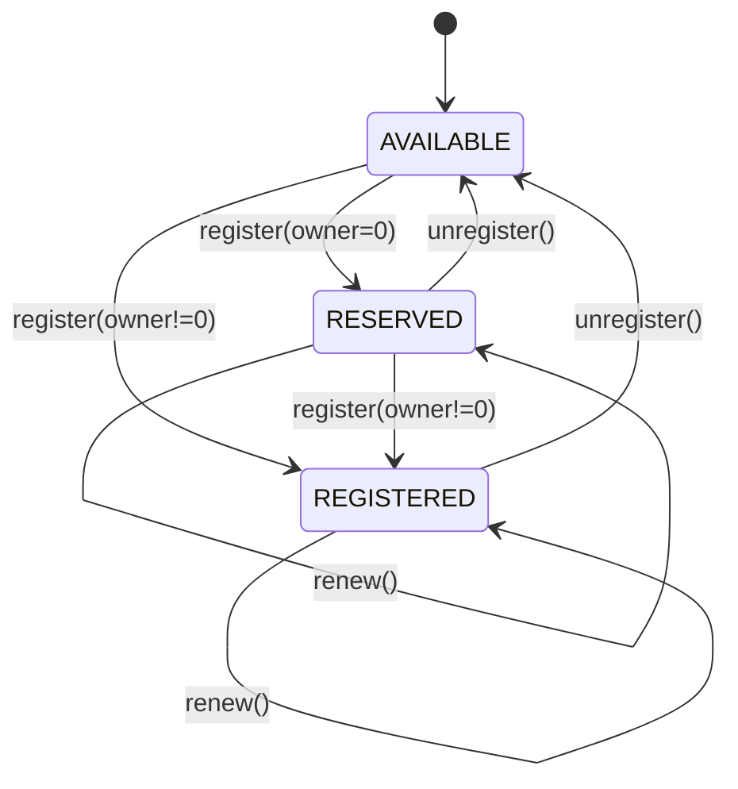

## Introduction

The ENS v2 registry system is a fundamental redesign that transforms domain names into tradeable ERC-1155 tokens with fine-grained access control. Each registry manages subdomains as individual tokens with customizable permissions, enabling sophisticated delegation and governance patterns.

## Core Architecture

The registry system consists of four primary contracts:

<CardGroup cols={2}>
  <Card title="PermissionedRegistry" icon="shield" href="/registry/permissioned-registry">
    Base contract implementing role-based access control for domain management
  </Card>
  <Card title="UserRegistry" icon="user" href="/registry/user-registry">
    Upgradeable registry for user-created subregistries
  </Card>
  <Card title="WrapperRegistry" icon="box" href="/registry/wrapper-registry">
    Migration-enabled registry for locked ENS v1 names
  </Card>
  <Card title="Registry Datastore" icon="database" href="/registry/registry-datastore">
    Singleton storage pattern using ERC-1155 for efficient token management
  </Card>
</CardGroup>

## Key Concepts

### Name Lifecycle States

Each subdomain in a registry exists in one of three states:

```solidity
enum Status {
    AVAILABLE,   // Can be registered by anyone with ROLE_REGISTRAR
    RESERVED,    // Label reserved with expiry but no owner
    REGISTERED   // Fully registered with owner and token minted
}
```

<Steps>
  <Step title="Available">
    The default state for any unregistered label. Anyone with `ROLE_REGISTRAR` on the parent registry can register it.
  </Step>
  <Step title="Reserved">
    A transitional state where a label has an expiry but no owner. Useful for name auctions or grace periods. Only accounts with `ROLE_REGISTER_RESERVED` can complete the registration.
  </Step>
  <Step title="Registered">
    The name has an owner, a minted ERC-1155 token, and optionally a subregistry and resolver. The owner has full control according to their granted roles.
  </Step>
</Steps>

### Versioned Identifiers

The registry uses three types of identifiers that can be used interchangeably in most functions:

<AccordionGroup>
  <Accordion title="Label ID (Storage ID)">
    The `keccak256` hash of the label without version information. Used as the storage key.
    
    ```solidity
    uint256 labelId = uint256(keccak256(bytes("example")));
    ```
  </Accordion>
  
  <Accordion title="Token ID">
    Label ID combined with `tokenVersionId` to create a unique ERC-1155 token ID. The version increments when roles change or tokens are regenerated.
    
    ```solidity
    uint256 tokenId = labelId | (uint256(tokenVersionId) << 248);
    ```
  </Accordion>
  
  <Accordion title="Resource ID">
    Label ID combined with `eacVersionId` for access control. The version increments when the name is unregistered or expires.
    
    ```solidity
    uint256 resource = labelId | (uint256(eacVersionId) << 248);
    ```
  </Accordion>
</AccordionGroup>

<Note>
  Most registry functions accept `anyId` parameters, which can be any of these three identifier types. The contract automatically extracts the label ID and constructs the appropriate versioned identifier.
</Note>

## Registration Flow

The registration process varies depending on the current state of the name:



### Registering an Available Name

Requires `ROLE_REGISTRAR` on the parent registry:

```solidity
// Register "example" under a registry
uint256 tokenId = registry.register(
    "example",                    // label
    msg.sender,                   // owner
    IRegistry(address(0)),        // no subregistry
    address(resolver),            // resolver address
    RegistryRolesLib.ROLE_RENEW | // grant renewal rights
    RegistryRolesLib.ROLE_SET_RESOLVER,
    uint64(block.timestamp + 365 days) // expiry
);
```

### Creating a Reservation

Pass `address(0)` as the owner to reserve a name without minting a token:

```solidity
uint256 tokenId = registry.register(
    "reserved",
    address(0),                   // no owner = reservation
    IRegistry(address(0)),
    address(0),
    0,                            // roleBitmap must be 0 for reservations
    uint64(block.timestamp + 7 days)
);
```

### Completing a Reserved Registration

Requires `ROLE_REGISTER_RESERVED` on the parent registry:

```solidity
// Convert reservation to full registration
registry.register(
    "reserved",
    newOwner,
    IRegistry(address(0)),
    address(resolver),
    desiredRoles,
    0  // expiry=0 uses existing reservation expiry
);
```

## Entry Storage Structure

Each registered name is stored as an `Entry` struct:

```solidity
struct Entry {
    uint32 eacVersionId;      // Access control version
    uint32 tokenVersionId;    // Token ID version
    IRegistry subregistry;    // Optional subregistry contract
    uint64 expiry;            // Unix timestamp expiration
    address resolver;         // Address resolver contract
}
```

<Info>
  **Storage Efficiency**: By using version IDs instead of full-size counters and packing all fields into a single storage slot, the registry minimizes gas costs for common operations.
</Info>

## Token Regeneration

When roles are granted or revoked on a registered name, the ERC-1155 token is "regenerated":

1. The old token is burned
2. `tokenVersionId` is incremented
3. A new token with the updated ID is minted to the same owner

This ensures ERC-1155 compliance where token IDs are immutable and balances never exceed 1.

```solidity
// Example: Granting a role triggers regeneration
registry.grantRoles(
    tokenId,
    RegistryRolesLib.ROLE_SET_RESOLVER,
    delegate
);
// Event: TokenRegenerated(oldTokenId, newTokenId)
```

## Subregistries

Each registered name can optionally have a subregistry - another registry contract that manages its subdomains:

```solidity
// Deploy a new UserRegistry for "example"
IRegistry subregistry = deployUserRegistry(...);

// Set it as the subregistry
registry.setSubregistry(tokenId, subregistry);

// Now resolution follows the chain
// example.eth -> registry.getSubregistry("example")
//             -> subregistry.getResolver("subdomain")
```

<Warning>
  Setting a subregistry requires `ROLE_SET_SUBREGISTRY` on the name's token resource. This role can be restricted to prevent unauthorized registry changes.
</Warning>

## Parent References

Registries maintain a canonical reference to their parent:

```solidity
// Set the canonical parent location
registry.setParent(
    parentRegistry,
    "example"  // This registry's label in the parent
);

// Query the parent
(IRegistry parent, string memory label) = registry.getParent();
```

This enables:
- Upward traversal during name resolution
- Discovery of the full domain path
- Migration path validation

## Expiry and Renewal

All registered and reserved names have an expiry timestamp:

```solidity
// Check expiry
uint64 expiry = registry.getExpiry(tokenId);

if (block.timestamp >= expiry) {
    // Name is expired - cannot use or modify
}

// Renew with ROLE_RENEW
registry.renew(
    tokenId,
    uint64(block.timestamp + 365 days) // new expiry (must be > current)
);
```

<Note>
  Expired names remain in storage but return `address(0)` for `ownerOf()` and `AVAILABLE` status. They can be re-registered without requiring `ROLE_REGISTER_RESERVED`.
</Note>

## State Queries

The registry provides comprehensive state inspection:

```solidity
// Get complete state in one call
IPermissionedRegistry.State memory state = registry.getState(anyId);
// state.status      -> AVAILABLE | RESERVED | REGISTERED
// state.expiry      -> Unix timestamp
// state.latestOwner -> Current owner (or address(0))
// state.tokenId     -> Current token ID
// state.resource    -> Current resource ID for access control

// Individual queries
Status status = registry.getStatus(anyId);
uint256 tokenId = registry.getTokenId(anyId);
uint256 resource = registry.getResource(anyId);
address owner = registry.latestOwnerOf(tokenId);
```

## Events

The registry emits comprehensive events for indexing:

```solidity
event NameRegistered(
    uint256 indexed tokenId,
    bytes32 indexed labelHash,
    string label,
    address owner,
    uint64 expiry,
    address indexed sender
);

event NameReserved(
    uint256 indexed tokenId,
    bytes32 indexed labelHash,
    string label,
    uint64 expiry,
    address indexed sender
);

event TokenRegenerated(
    uint256 indexed oldTokenId,
    uint256 indexed newTokenId
);

event TokenResource(
    uint256 indexed tokenId,
    uint256 indexed resource
);
```

## Next Steps

<CardGroup cols={2}>
  <Card title="PermissionedRegistry" icon="book" href="/registry/permissioned-registry">
    Deep dive into the base registry implementation
  </Card>
  <Card title="Registry Roles" icon="key" href="/access-control/registry-roles">
    Learn about the role-based permission system
  </Card>
  <Card title="UserRegistry" icon="user" href="/registry/user-registry">
    Explore upgradeable user-deployed registries
  </Card>
  <Card title="Resolution" icon="route" href="/resolution/universal-resolver">
    Understand how names resolve to addresses
  </Card>
</CardGroup>