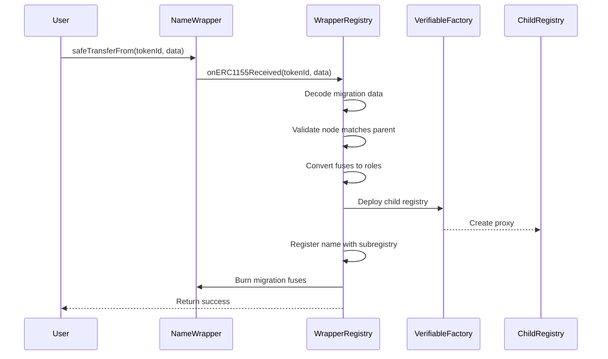

## Overview

`WrapperRegistry` is a specialized upgradeable registry that enables migration of locked ENS v1 NameWrapper tokens to ENS v2. It accepts ERC-1155 transfers from the NameWrapper contract, converts the v1 fuses to v2 roles, and creates new registrations with appropriate permissions.

## Contract Details

**Location**: `contracts/src/registry/WrapperRegistry.sol`

**Inherits**:
- `IWrapperRegistry` - Wrapper-specific interface
- `PermissionedRegistry` - Core registry functionality
- `WrapperReceiver` - Migration logic and NameWrapper integration
- `Initializable` - Proxy initialization
- `UUPSUpgradeable` - Upgrade mechanism

**Interface Selector**: `0x8cd02f97`

## Architecture

### Migration Flow



## Constructor

```solidity
constructor(
    INameWrapper nameWrapper,
    VerifiableFactory verifiableFactory,
    address ensV1Resolver,
    IHCAFactoryBasic hcaFactory,
    IRegistryMetadata metadataProvider
)
```

**Parameters**:
- `nameWrapper` - ENS v1 NameWrapper contract
- `verifiableFactory` - Factory for deploying child registries
- `ensV1Resolver` - Address of v1 public resolver
- `hcaFactory` - Hierarchical contract address factory
- `metadataProvider` - Metadata provider for token URIs

**Immutable Storage**:
```solidity
address public immutable V1_RESOLVER;
```

**Example**:

```solidity
WrapperRegistry registry = new WrapperRegistry(
    INameWrapper(0x...),          // v1 NameWrapper
    verifiableFactory,
    0x...,                        // v1 PublicResolver
    hcaFactory,
    metadataProvider
);
```

## Initialization

### initialize

```solidity
function initialize(
    IWrapperRegistry.ConstructorArgs calldata args
) public initializer
```

**ConstructorArgs Struct**:

```solidity
struct ConstructorArgs {
    bytes32 node;          // Parent node (namehash)
    address owner;         // Initial owner
    uint256 ownerRoles;    // Roles to grant owner
}
```

**Example**:

```solidity
// Initialize for nick.eth
bytes32 nodeNick = namehash("nick.eth");

registry.initialize(
    IWrapperRegistry.ConstructorArgs({
        node: nodeNick,
        owner: msg.sender,
        ownerRoles: RegistryRolesLib.ROLE_REGISTRAR |
                    RegistryRolesLib.ROLE_REGISTRAR_ADMIN
    })
);
```

**Automatic Role Grants**:

The initialization automatically grants:
- `ROLE_UPGRADE` - Allow owner to upgrade
- `ROLE_UPGRADE_ADMIN` - Allow owner to manage upgrade permissions
- `ownerRoles` - Custom roles specified in args

## Migration System

### Migration Data Structure

```solidity
struct Data {
    string label;      // DNS label of the name
    address owner;     // Recipient of v2 name
    address resolver;  // Resolver address (may be overridden)
    uint256 salt;      // Salt for subregistry deployment
}
```

### Single Name Migration

Migrate one name via `safeTransferFrom`:

```solidity
// Prepare migration data
IWrapperRegistry.Data memory migrationData = IWrapperRegistry.Data({
    label: "sub",
    owner: recipient,
    resolver: address(v2Resolver),
    salt: keccak256(abi.encodePacked("sub.nick.eth"))
});

// Transfer to migrate
nameWrapper.safeTransferFrom(
    msg.sender,
    address(wrapperRegistry),
    uint256(node),  // namehash("sub.nick.eth")
    1,
    abi.encode(migrationData)
);
```

### Batch Migration

Migrate multiple names at once:

```solidity
uint256[] memory tokenIds = new uint256[](2);
tokenIds[0] = uint256(namehash("sub1.nick.eth"));
tokenIds[1] = uint256(namehash("sub2.nick.eth"));

IWrapperRegistry.Data[] memory migrations = new IWrapperRegistry.Data[](2);
migrations[0] = IWrapperRegistry.Data({
    label: "sub1",
    owner: recipient1,
    resolver: address(resolver),
    salt: keccak256("sub1")
});
migrations[1] = IWrapperRegistry.Data({
    label: "sub2",
    owner: recipient2,
    resolver: address(resolver),
    salt: keccak256("sub2")
});

uint256[] memory amounts = new uint256[](2);
amounts[0] = 1;
amounts[1] = 1;

nameWrapper.safeBatchTransferFrom(
    msg.sender,
    address(wrapperRegistry),
    tokenIds,
    amounts,
    abi.encode(migrations)
);
```

## Fuse to Role Conversion

WrapperRegistry converts ENS v1 fuses to ENS v2 roles:

### Fuse Mapping

<Tabs>
  <Tab title="Token Roles (In Parent)">
    These roles are granted on the token in the parent registry:
    
    | v1 Fuse | v2 Role | Description |
    |---------|---------|-------------|
    | `CAN_EXTEND_EXPIRY` | `ROLE_RENEW` | Can renew expiration |
    | `!CANNOT_SET_RESOLVER` | `ROLE_SET_RESOLVER` | Can change resolver |
    | `!CANNOT_TRANSFER` | `ROLE_CAN_TRANSFER_ADMIN` | Can transfer token |
    | `!CANNOT_BURN_FUSES` | `*_ADMIN` variants | Can modify roles |
  </Tab>
  
  <Tab title="Registry Roles (In Subregistry)">
    These roles are granted on ROOT_RESOURCE of the name's subregistry:
    
    | v1 Fuse | v2 Role | Description |
    |---------|---------|-------------|
    | `!CANNOT_CREATE_SUBDOMAIN` | `ROLE_REGISTRAR` | Can register subdomains |
    | Always granted | `ROLE_RENEW` | Can renew subdomains |
    | `!CANNOT_BURN_FUSES` | `*_ADMIN` variants | Can modify subdomain roles |
  </Tab>
</Tabs>

### Conversion Logic

```solidity
function _generateRoleBitmapsFromFuses(uint32 fuses)
    internal pure
    returns (
        bool fusesFrozen,
        uint256 tokenRoles,
        uint256 registryRoles
    )
{
    // Fuses are frozen if CANNOT_BURN_FUSES is set
    fusesFrozen = (fuses & CANNOT_BURN_FUSES) != 0;
    
    // CAN_EXTEND_EXPIRY -> ROLE_RENEW
    if ((fuses & CAN_EXTEND_EXPIRY) != 0) {
        tokenRoles |= RegistryRolesLib.ROLE_RENEW;
        if (!fusesFrozen) {
            tokenRoles |= RegistryRolesLib.ROLE_RENEW_ADMIN;
        }
    }
    
    // !CANNOT_SET_RESOLVER -> ROLE_SET_RESOLVER
    if ((fuses & CANNOT_SET_RESOLVER) == 0) {
        tokenRoles |= RegistryRolesLib.ROLE_SET_RESOLVER;
        if (!fusesFrozen) {
            tokenRoles |= RegistryRolesLib.ROLE_SET_RESOLVER_ADMIN;
        }
    }
    
    // !CANNOT_TRANSFER -> ROLE_CAN_TRANSFER_ADMIN
    if ((fuses & CANNOT_TRANSFER) == 0) {
        tokenRoles |= RegistryRolesLib.ROLE_CAN_TRANSFER_ADMIN;
    }
    
    // !CANNOT_CREATE_SUBDOMAIN -> ROLE_REGISTRAR on subregistry
    if ((fuses & CANNOT_CREATE_SUBDOMAIN) == 0) {
        registryRoles |= RegistryRolesLib.ROLE_REGISTRAR;
        if (!fusesFrozen) {
            registryRoles |= RegistryRolesLib.ROLE_REGISTRAR_ADMIN;
        }
    }
    
    // Always grant renewal rights on subregistry
    registryRoles |= RegistryRolesLib.ROLE_RENEW;
    registryRoles |= RegistryRolesLib.ROLE_RENEW_ADMIN;
}
```

## Resolver Handling

WrapperRegistry has special resolver logic:

### Migration-Time Resolver

```solidity
if ((fuses & CANNOT_SET_RESOLVER) != 0) {
    // Resolver is locked - use v1 resolver
    migrationData.resolver = NAME_WRAPPER.ens().resolver(node);
} else {
    // Resolver is unlocked - clear v1 resolver
    NAME_WRAPPER.setResolver(node, address(0));
    // Use resolver from migration data
}
```

### Fallback for Migratable Children

```solidity
function getResolver(string calldata label)
    public view override returns (address)
{
    // If child is emancipated but not yet migrated, return v1 resolver
    return _isMigratableChild(label)
        ? V1_RESOLVER
        : super.getResolver(label);
}
```

<Info>
  This allows names to remain resolvable in v1 until they are migrated to v2.
</Info>

## Migration Restrictions

### register Override

```solidity
function register(
    string memory label,
    address owner,
    IRegistry registry,
    address resolver,
    uint256 roleBitmap,
    uint64 expiry
) public override returns (uint256 tokenId) {
    // Prevent manual registration of migratable names
    if (_isMigratableChild(label)) {
        revert MigrationErrors.NameRequiresMigration();
    }
    return super.register(label, owner, registry, resolver, roleBitmap, expiry);
}
```

<Warning>
  Names that exist as locked tokens in the v1 NameWrapper cannot be registered manually. They must be migrated via token transfer.
</Warning>

### Migratable Child Check

```solidity
function _isMigratableChild(string memory label)
    internal view returns (bool)
{
    bytes32 node = NameCoder.namehash(_parentNode(), keccak256(bytes(label)));
    (address ownerV1, uint32 fuses, ) = NAME_WRAPPER.getData(uint256(node));
    
    // Migratable if:
    // - Not yet migrated (owner != this)
    // - Is emancipated (CANNOT_UNWRAP set)
    return ownerV1 != address(this) && (fuses & CANNOT_UNWRAP) != 0;
}
```

## Subregistry Creation

During migration, a new WrapperRegistry is deployed for each name:

```solidity
IRegistry subregistry = IRegistry(
    VERIFIABLE_FACTORY.deployProxy(
        WRAPPER_REGISTRY_IMPL,  // Self-reference: deploy another WrapperRegistry
        migrationData.salt,
        abi.encodeCall(
            IWrapperRegistry.initialize,
            (
                IWrapperRegistry.ConstructorArgs({
                    node: node,
                    owner: migrationData.owner,
                    ownerRoles: registryRoles
                })
            )
        )
    )
);
```

This creates a hierarchical structure:

```
eth (WrapperRegistry)
└── nick.eth (WrapperRegistry)
    ├── sub.nick.eth (WrapperRegistry)
    │   └── deep.sub.nick.eth (WrapperRegistry)
    └── other.nick.eth (WrapperRegistry)
```

## Fuse Burning

After successful migration, migration-specific fuses are burned:

```solidity
uint32 constant FUSES_TO_BURN = CANNOT_BURN_FUSES |
    CANNOT_TRANSFER |
    CANNOT_SET_RESOLVER |
    CANNOT_SET_TTL |
    CANNOT_CREATE_SUBDOMAIN;

if (!fusesFrozen) {
    NAME_WRAPPER.setFuses(node, uint16(FUSES_TO_BURN));
}
```

<Note>
  This prevents the name from being modified in v1 after migration. If fuses are already frozen, this step is skipped.
</Note>

## Usage Examples

### Migrate 2LD (.eth name)

```solidity
// Setup: alice.eth is locked in NameWrapper
bytes32 node = namehash("alice.eth");

// Prepare for LockedMigrationController (not WrapperRegistry)
IWrapperRegistry.Data memory data = IWrapperRegistry.Data({
    label: "alice",
    owner: msg.sender,
    resolver: address(newResolver),
    salt: keccak256("alice.eth-migration")
});

// Transfer to LockedMigrationController
nameWrapper.safeTransferFrom(
    msg.sender,
    address(lockedMigrationController),
    uint256(node),
    1,
    abi.encode(data)
);

// Creates: WrapperRegistry for alice.eth
// Registered in ETHRegistry
```

### Migrate 3LD (subdomain)

```solidity
// Setup: sub.alice.eth is locked and alice.eth is already migrated
WrapperRegistry aliceRegistry = WrapperRegistry(aliceEthSubregistry);

bytes32 subNode = namehash("sub.alice.eth");

IWrapperRegistry.Data memory subData = IWrapperRegistry.Data({
    label: "sub",
    owner: subOwner,
    resolver: address(resolver),
    salt: keccak256("sub.alice.eth-migration")
});

// Transfer to alice.eth's WrapperRegistry
nameWrapper.safeTransferFrom(
    msg.sender,
    address(aliceRegistry),
    uint256(subNode),
    1,
    abi.encode(subData)
);

// Creates: WrapperRegistry for sub.alice.eth
// Registered in alice.eth's WrapperRegistry
```

### Migrate with Locked Resolver

```solidity
// Name has CANNOT_SET_RESOLVER fuse burned
uint32 fuses = CANNOT_UNWRAP | CANNOT_SET_RESOLVER;

IWrapperRegistry.Data memory data = IWrapperRegistry.Data({
    label: "locked",
    owner: msg.sender,
    resolver: address(0),  // Will be ignored
    salt: keccak256("salt")
});

// During migration:
// - V1 resolver is read from NameWrapper
// - V2 registration uses that resolver
// - ROLE_SET_RESOLVER is NOT granted
```

### Migrate Non-Transferable Name

```solidity
// Name has CANNOT_TRANSFER fuse burned
uint32 fuses = CANNOT_UNWRAP | CANNOT_TRANSFER;

IWrapperRegistry.Data memory data = IWrapperRegistry.Data({
    label: "soulbound",
    owner: msg.sender,
    resolver: address(resolver),
    salt: keccak256("salt")
});

// After migration:
// - ROLE_CAN_TRANSFER_ADMIN is NOT granted
// - Token cannot be transferred in v2
// - Preserves soulbound nature
```

## Error Handling

### Migration Errors

```solidity
// From MigrationErrors library
error NameRequiresMigration();           // Manual registration blocked
error NameDataMismatch(uint256 node);    // Label doesn't match node
error NameNotLocked(uint256 node);       // Missing CANNOT_UNWRAP fuse

// From WrapperRegistry
error InvalidData();  // Migration data too short or malformed
```

### Wrapped Errors

Errors from `onERC1155Received` are wrapped:

```solidity
// Caller must unwrap to get actual error
try nameWrapper.safeTransferFrom(...) {
    // Success
} catch (bytes memory error) {
    bytes memory unwrapped = WrappedErrorLib.unwrap(error);
    // Decode unwrapped to get actual revert reason
}
```

## Security Considerations

<Warning>
  **Parent Node Validation**: The migration process validates that the label hash matches the parent node. Mismatch causes revert.
</Warning>

<Warning>
  **Lock Requirement**: Only names with `CANNOT_UNWRAP` fuse can be migrated. This ensures the name is truly locked.
</Warning>

<Warning>
  **Owner Validation**: The migration data owner cannot be `address(0)`. This prevents invalid registrations.
</Warning>

<Info>
  **Fuse Burning**: After migration, names have additional fuses burned in v1 to prevent conflicting modifications.
</Info>

## Parent Node Storage

```solidity
bytes32 public parentNode;

function _parentNode() internal view override returns (bytes32) {
    return parentNode;
}
```

The parent node is stored during initialization and used to:
- Validate migration data
- Check if children are migratable
- Support `parentName()` queries

## Querying Parent Name

```solidity
function parentName() external view returns (bytes memory) {
    return NAME_WRAPPER.names(_parentNode());
}
```

Returns the DNS-encoded name from the NameWrapper.

## Related Documentation

<CardGroup cols={2}>
  <Card title="Migration Overview" icon="arrow-right" href="/migration/overview">
    High-level migration concepts and strategies
  </Card>
  <Card title="Locked Migration" icon="lock" href="/migration/locked-migration">
    Migrating 2LD .eth names via LockedMigrationController
  </Card>
  <Card title="UserRegistry" icon="user" href="/registry/user-registry">
    Standard upgradeable registry (non-migration)
  </Card>
  <Card title="Migration Overview" icon="exchange" href="/migration/overview">
    Detailed fuse-to-role conversion reference
  </Card>
</CardGroup>