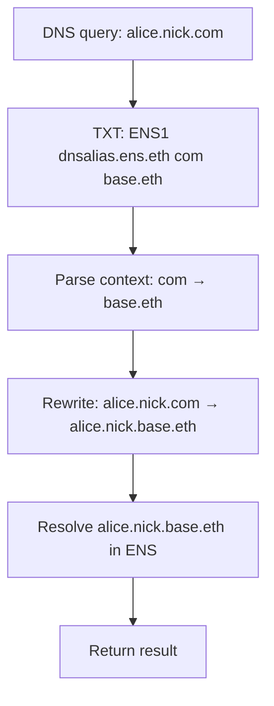

## Overview

The DNS resolver suite enables ENS resolution using DNSSEC-verified DNS records. This allows traditional DNS domain owners to participate in the ENS ecosystem without importing their domains on-chain.

<Info>
All three resolvers work together: DNSTLDResolver orchestrates the resolution, while DNSTXTResolver and DNSAliasResolver provide the actual data.
</Info>

<CardGroup cols={3}>
  <Card title="DNSTLDResolver" icon="sitemap">
    Top-level orchestrator and DNSSEC verifier
  </Card>
  <Card title="DNSTXTResolver" icon="file-lines">
    Parse data from TXT records
  </Card>
  <Card title="DNSAliasResolver" icon="link">
    Redirect to ENS names
  </Card>
</CardGroup>

## DNSTXTResolver

Resolves ENS records directly from data encoded in DNSSEC TXT records.

### TXT Record Format

TXT records must follow this format:

```
ENS1 dnstxt.ens.eth <context>
```

<ParamField path="ENS1" type="string">
  Magic prefix identifying ENS data
</ParamField>

<ParamField path="dnstxt.ens.eth" type="string">
  The resolver address (must resolve to DNSTXTResolver)
</ParamField>

<ParamField path="<context>" type="string">
  Space-separated key=value pairs with the actual data
</ParamField>

### Supported Record Types

<Tabs>
  <Tab title="Text Records">
    ```
    t[key]=value
    ```
    
    **Examples:**
    ```
    t[age]=18
    t[description]="Once upon a time, ..."
    t[notice]="\"E N S!\""
    ```
    
    <Note>
    Use quotes for values with spaces. Escape quotes inside quoted strings with backslash.
    </Note>
  </Tab>
  
  <Tab title="Addresses">
    ```
    a[coinType]=0x...
    ```
    
    **Examples:**
    ```
    a[60]=0x1234567890123456789012345678901234567890
    a[e0]=0x...          # Default EVM address
    a[e59144]=0x...      # Linea address
    a[0]=0x00...         # Bitcoin address
    ```
    
    <Info>
    - `a[60]` - Ethereum mainnet (coin type 60)
    - `a[e<chain>]` - EVM chain by chain ID
    - `a[e0]` - Default EVM address (fallback)
    </Info>
  </Tab>
  
  <Tab title="Content Hash">
    ```
    c=0x...
    ```
    
    **Example:**
    ```
    c=0xe3010170122029f2d17be6139079dc48696d1f582a8530eb9805b561eda517e22a892c7e3f1f
    ```
    
    <Note>
    Use ENSIP-7 content hash encoding (IPFS, Swarm, etc.)
    </Note>
  </Tab>
  
  <Tab title="Public Key">
    ```
    xy=0x...
    ```
    
    **Example:**
    ```
    xy=0x1234...5678  # 64 bytes (32-byte x + 32-byte y)
    ```
    
    <Warning>
    Must be exactly 64 bytes (SECP256k1 public key coordinates).
    </Warning>
  </Tab>
</Tabs>

### Complete TXT Record Examples

<AccordionGroup>
  <Accordion title="Basic Profile">
    ```dns
    example.com.  IN  TXT  "ENS1 dnstxt.ens.eth a[60]=0x1234567890123456789012345678901234567890 t[com.twitter]=alice t[avatar]=https://example.com/avatar.png"
    ```
  </Accordion>
  
  <Accordion title="Multi-Chain Addresses">
    ```dns
    example.com.  IN  TXT  "ENS1 dnstxt.ens.eth a[60]=0xEthAddr a[0]=0xBitcoinAddr a[e137]=0xPolygonAddr a[e0]=0xDefaultEVMAddr"
    ```
  </Accordion>
  
  <Accordion title="IPFS Content">
    ```dns
    example.com.  IN  TXT  "ENS1 dnstxt.ens.eth c=0xe3010170122029f2d17be6139079dc48696d1f582a8530eb9805b561eda517e22a892c7e3f1f"
    ```
  </Accordion>
  
  <Accordion title="Complex Text Data">
    ```dns
    example.com.  IN  TXT  "ENS1 dnstxt.ens.eth t[description]='Alice\\'s ENS profile' t[url]='https://alice.example.com' t[email]=alice@example.com"
    ```
  </Accordion>
</AccordionGroup>

### Contract Interface

```solidity
contract DNSTXTResolver is ERC165, IERC7996, IExtendedDNSResolver {
    function resolve(
        bytes calldata /* name */,
        bytes calldata data,
        bytes calldata context
    ) external view returns (bytes memory result)
}
```

<ParamField path="name" type="bytes">
  DNS-encoded name (unused, resolver uses context)
</ParamField>

<ParamField path="data" type="bytes">
  Encoded resolver profile query
</ParamField>

<ParamField path="context" type="bytes">
  The TXT record context string
</ParamField>

### Supported Profile Queries

<table>
  <thead>
    <tr>
      <th>Function</th>
      <th>Selector</th>
      <th>Returns</th>
    </tr>
  </thead>
  <tbody>
    <tr>
      <td>`addr(bytes32)`</td>
      <td>`IAddrResolver.addr.selector`</td>
      <td>Ethereum address</td>
    </tr>
    <tr>
      <td>`addr(bytes32,uint256)`</td>
      <td>`IAddressResolver.addr.selector`</td>
      <td>Address for coin type</td>
    </tr>
    <tr>
      <td>`hasAddr(bytes32,uint256)`</td>
      <td>`IHasAddressResolver.hasAddr.selector`</td>
      <td>Boolean</td>
    </tr>
    <tr>
      <td>`text(bytes32,string)`</td>
      <td>`ITextResolver.text.selector`</td>
      <td>Text value</td>
    </tr>
    <tr>
      <td>`contenthash(bytes32)`</td>
      <td>`IContentHashResolver.contenthash.selector`</td>
      <td>Content hash</td>
    </tr>
    <tr>
      <td>`pubkey(bytes32)`</td>
      <td>`IPubkeyResolver.pubkey.selector`</td>
      <td>Public key x,y</td>
    </tr>
    <tr>
      <td>`multicall(bytes[])`</td>
      <td>`IMulticallable.multicall.selector`</td>
      <td>Array of results</td>
    </tr>
  </tbody>
</table>

### Usage Example

```solidity
// Context from TXT record
bytes memory context = "a[60]=0x1234567890123456789012345678901234567890 t[avatar]=https://example.com/avatar.png";

// Query for address
bytes memory query = abi.encodeCall(
    IAddrResolver.addr,
    (bytes32(0)) // node doesn't matter, data is in context
);

bytes memory result = dnsResolver.resolve("", query, context);
address ethAddr = abi.decode(result, (address));
// ethAddr == 0x1234567890123456789012345678901234567890
```

### Errors

```solidity
error UnsupportedResolverProfile(bytes4 selector);
error InvalidHexData(bytes data);
error InvalidDataLength(bytes data, uint256 expected);
```

## DNSAliasResolver

Redirects DNS name resolution to an ENS name, enabling gasless off-chain DNS domains to use existing ENS infrastructure.

### TXT Record Format

```
ENS1 <resolver-address> <context>
```

Two context formats are supported:

<Tabs>
  <Tab title="Rewrite (Suffix Replacement)">
    ```
    ENS1 dnsalias.ens.eth <oldSuffix> <newSuffix>
    ```
    
    Replaces the matching suffix in the queried name.
    
    **Example:**
    ```dns
    *.nick.com.  IN  TXT  "ENS1 dnsalias.ens.eth com base.eth"
    ```
    
    Resolution:
    - Query: `alice.nick.com` → `alice.nick.base.eth`
    - Query: `bob.nick.com` → `bob.nick.base.eth`
  </Tab>
  
  <Tab title="Replace (Full Replacement)">
    ```
    ENS1 dnsalias.ens.eth <newName>
    ```
    
    Completely replaces the queried name.
    
    **Example:**
    ```dns
    notdot.net.  IN  TXT  "ENS1 dnsalias.ens.eth nick.eth"
    ```
    
    Resolution:
    - Query: `notdot.net` → `nick.eth`
  </Tab>
</Tabs>

### Constructor

```solidity
constructor(
    IRegistry rootRegistry,
    IGatewayProvider batchGatewayProvider
)
```

<ParamField path="rootRegistry" type="IRegistry">
  Root ENS v2 registry for resolution
</ParamField>

<ParamField path="batchGatewayProvider" type="IGatewayProvider">
  CCIP-Read gateway provider for batch operations
</ParamField>

### Resolution Function

```solidity
function resolve(
    bytes calldata name,
    bytes calldata data,
    bytes calldata context
) external view returns (bytes memory)
```

### Rewrite Logic

```solidity
function rewriteNameWithContext(
    bytes calldata name,
    bytes calldata context
) public pure returns (bytes memory)
```

#### Example: Name Rewriting

```solidity
// Rewrite rule: "com" -> "base.eth"
bytes memory name = dnsEncode("alice.nick.com");
bytes memory context = "com base.eth";

bytes memory newName = aliasResolver.rewriteNameWithContext(name, context);
// newName == dnsEncode("alice.nick.base.eth")
```

```solidity
// Replace rule: "notdot.net" -> "nick.eth"
bytes memory name = dnsEncode("notdot.net");
bytes memory context = "nick.eth";

bytes memory newName = aliasResolver.rewriteNameWithContext(name, context);
// newName == dnsEncode("nick.eth")
```

### Complete Flow



### Errors

```solidity
error NoSuffixMatch(bytes name, bytes suffix);
```

## DNSTLDResolver

The top-level orchestrator that verifies DNSSEC records and delegates to appropriate resolvers.

### Architecture

The DNSTLDResolver:
1. Checks if a name has a V1 resolver
2. If not, queries DNSSEC oracle for TXT records
3. Verifies DNSSEC signatures
4. Parses the TXT record to find resolver and context
5. Calls the specified resolver with the context

### Constructor

```solidity
constructor(
    ENS ensRegistryV1,
    address dnsTLDResolverV1,
    IRegistry rootRegistry,
    DNSSEC dnssecOracle,
    IGatewayProvider oracleGatewayProvider,
    IGatewayProvider batchGatewayProvider
)
```

<ParamField path="ensRegistryV1" type="ENS">
  ENS v1 registry for fallback
</ParamField>

<ParamField path="dnsTLDResolverV1" type="address">
  V1 DNS resolver address
</ParamField>

<ParamField path="rootRegistry" type="IRegistry">
  ENS v2 root registry
</ParamField>

<ParamField path="dnssecOracle" type="DNSSEC">
  DNSSEC oracle for verification
</ParamField>

<ParamField path="oracleGatewayProvider" type="IGatewayProvider">
  Gateway for DNSSEC queries
</ParamField>

<ParamField path="batchGatewayProvider" type="IGatewayProvider">
  Gateway for batch resolver calls
</ParamField>

### Resolution Process

<Steps>
  <Step title="Check V1 Registry">
    First checks if a resolver exists in ENS v1
  </Step>
  
  <Step title="Query DNSSEC Oracle">
    If no V1 resolver, triggers CCIP-Read to fetch TXT records
  </Step>
  
  <Step title="Verify Records">
    Verifies DNSSEC signatures using the oracle
  </Step>
  
  <Step title="Parse TXT Record">
    Extracts resolver address and context from TXT record
  </Step>
  
  <Step title="Call Resolver">
    Delegates to the specified resolver with context
  </Step>
</Steps>

### Main Resolution Function

```solidity
function resolve(
    bytes calldata name,
    bytes calldata data
) external view returns (bytes memory)
```

<Note>
This function uses CCIP-Read (EIP-3668) and will revert with `OffchainLookup` to trigger off-chain data fetching.
</Note>

### DNSSEC Record Retrieval

```solidity
function getDNSSECRecords(
    bytes calldata name
) external view returns (bytes[] memory)
```

Fetches and verifies all DNSSEC TXT records for a name.

#### Example: Fetching DNS Records

```javascript
// Using ethers.js with CCIP-Read support
const records = await dnsTLDResolver.getDNSSECRecords(
  dnsEncode('example.com')
);

records.forEach(record => {
  console.log('TXT record:', Buffer.from(record).toString());
});
```

### Parsing TXT Records

```solidity
function parseDNSSECRecord(
    bytes memory txt
) public view returns (
    address resolver,
    bytes memory context
)
```

<ParamField path="txt" type="bytes">
  The TXT record content
</ParamField>

<ResponseField name="resolver" type="address">
  Parsed resolver address, or zero if invalid
</ResponseField>

<ResponseField name="context" type="bytes">
  Context data to pass to resolver
</ResponseField>

#### Parsing Examples

```solidity
// Parse address literal
bytes memory txt = "ENS1 0x1234567890123456789012345678901234567890 context data";
(address resolver, bytes memory context) = dnsTLD.parseDNSSECRecord(txt);
// resolver = 0x1234567890123456789012345678901234567890
// context = "context data"
```

```solidity
// Parse ENS name
bytes memory txt = "ENS1 dnstxt.ens.eth a[60]=0x...";
(address resolver, bytes memory context) = dnsTLD.parseDNSSECRecord(txt);
// resolver = address resolved from dnstxt.ens.eth
// context = "a[60]=0x..."
```

### Composite Resolver Interface

```solidity
function requiresOffchain(bytes calldata name) external view returns (bool)

function getResolver(bytes calldata name) external view returns (address, bool)

function verifierMetadata(bytes calldata name) external view returns (
    address verifier,
    string[] memory gateways
)
```

<Accordion title="Example: Checking Resolution Type">
```solidity
bool needsOffchain = dnsTLD.requiresOffchain(dnsEncode("example.com"));

if (needsOffchain) {
    // This name requires DNSSEC lookup
    (address verifier, string[] memory gateways) = 
        dnsTLD.verifierMetadata(dnsEncode("example.com"));
    
    // verifier = DNSSEC oracle address
    // gateways = array of CCIP-Read gateway URLs
}
```
</Accordion>

### Errors

```solidity
error InvalidTXT();
```

## Complete Integration Example

Here's how all three resolvers work together:

### DNS Setup

```dns
; Zone file for example.com
example.com.  IN  TXT  "ENS1 dnstxt.ens.eth a[60]=0x1234567890123456789012345678901234567890 t[com.twitter]=alice"

; DNSSEC signatures (managed by DNS provider)
example.com.  IN  RRSIG  TXT ...
```

### Smart Contract Integration

```solidity
import {DNSTLDResolver} from "./dns/DNSTLDResolver.sol";
import {IAddrResolver} from "@ens/contracts/resolvers/profiles/IAddrResolver.sol";

contract DNSIntegration {
    DNSTLDResolver public dnsResolver;
    
    constructor(DNSTLDResolver _dnsResolver) {
        dnsResolver = _dnsResolver;
    }
    
    // Resolve using CCIP-Read
    function resolveAddress(string memory domain) external view returns (address) {
        bytes memory name = dnsEncode(domain);
        bytes memory query = abi.encodeCall(
            IAddrResolver.addr,
            (bytes32(0)) // node computed by resolver
        );
        
        bytes memory result = dnsResolver.resolve(name, query);
        return abi.decode(result, (address));
    }
}
```

### Frontend Integration

```javascript
import { ethers } from 'ethers';

// Provider must support CCIP-Read (most modern providers do)
const provider = new ethers.JsonRpcProvider(RPC_URL);

const dnsTLD = new ethers.Contract(
  DNS_TLD_RESOLVER_ADDRESS,
  DNS_TLD_RESOLVER_ABI,
  provider
);

// Resolve example.com
const name = dnsEncode('example.com');
const query = dnsTLD.interface.encodeFunctionData('addr', [ethers.ZeroHash]);

try {
  const result = await dnsTLD.resolve(name, query);
  const address = ethers.AbiCoder.defaultAbiCoder().decode(['address'], result)[0];
  console.log('Resolved address:', address);
} catch (error) {
  if (error.code === 'CALL_EXCEPTION') {
    // CCIP-Read in progress
    console.log('Fetching off-chain data...');
  }
}
```

## DNS Record Parsing

All resolvers use the `DNSTXTParserLib` library for parsing context data.

### Parser Grammar

```ebnf
<records> ::= " "* <rr>* " "*
     <rr> ::= <r> | <r> <rr>
      <r> ::= <pk> | <kv>
     <pk> ::= <u> | <u> "[" <a> "]" <u>
     <kv> ::= <k> "=" <v>
      <k> ::= <u> | <u> "[" <a> "]"
      <v> ::= "'" <q> "'" | <u>
      <q> ::= <all octets except "'" unless preceded by "\">
      <u> ::= <all octets except " ">
      <a> ::= <all octets except "]">
```

### Parsing Examples

<CodeGroup>
```solidity Unquoted Value
DNSTXTParserLib.find("a=x b=y", "a=")
// Returns: "x"
```

```solidity Quoted Value
DNSTXTParserLib.find("a='hello world'", "a=")
// Returns: "hello world"
```

```solidity Escaped Quotes
DNSTXTParserLib.find("a='it\\'s here'", "a=")
// Returns: "it's here"
```

```solidity With Arguments
DNSTXTParserLib.find("t[name]=alice t[age]=25", "t[name]=")
// Returns: "alice"
```
</CodeGroup>

## Security Considerations

<Warning>
**DNSSEC Trust**: The entire system relies on DNSSEC security. Ensure the DNSSEC oracle is properly configured and trusted.
</Warning>

<Warning>
**Gateway Trust**: CCIP-Read gateways must be trusted to return correct DNSSEC proofs. Use multiple gateways when possible.
</Warning>

<Note>
**Resolver Trust**: The TXT record specifies which resolver to use. This resolver must be trusted for the specific domain.
</Note>

<Tip>
**Caching**: DNSSEC records can be cached according to their TTL. Implement appropriate caching strategies off-chain.
</Tip>

## Gas Optimization

<AccordionGroup>
  <Accordion title="Batch Queries with Multicall">
    Use the `multicall` selector in your query to fetch multiple records in one CCIP-Read round trip.
  </Accordion>
  
  <Accordion title="Compact TXT Records">
    Keep context data minimal. Each byte costs gas when processed.
  </Accordion>
  
  <Accordion title="Use Default EVM Address">
    Set `a[e0]` as a fallback instead of specifying every EVM chain.
  </Accordion>
</AccordionGroup>

## Comparison Table

<table>
  <thead>
    <tr>
      <th>Feature</th>
      <th>DNSTXTResolver</th>
      <th>DNSAliasResolver</th>
      <th>DNSTLDResolver</th>
    </tr>
  </thead>
  <tbody>
    <tr>
      <td>Purpose</td>
      <td>Parse data from TXT</td>
      <td>Redirect to ENS</td>
      <td>Orchestrate DNSSEC</td>
    </tr>
    <tr>
      <td>Stores Data</td>
      <td>No (reads from context)</td>
      <td>No (reads from context)</td>
      <td>No (fetches from DNS)</td>
    </tr>
    <tr>
      <td>CCIP-Read</td>
      <td>No</td>
      <td>Yes</td>
      <td>Yes</td>
    </tr>
    <tr>
      <td>DNSSEC Verification</td>
      <td>No</td>
      <td>No</td>
      <td>Yes</td>
    </tr>
    <tr>
      <td>Typical Use</td>
      <td>Direct DNS data</td>
      <td>DNS → ENS bridge</td>
      <td>Entry point</td>
    </tr>
  </tbody>
</table>

## Related Resources

<CardGroup cols={3}>
  <Card title="DNSSEC Oracle" icon="shield-check">
    Learn about DNSSEC verification
  </Card>
  <Card title="CCIP-Read" icon="cloud">
    Understand off-chain data fetching
  </Card>
  <Card title="ENS Resolution" icon="magnifying-glass">
    General resolution documentation
  </Card>
</CardGroup>
