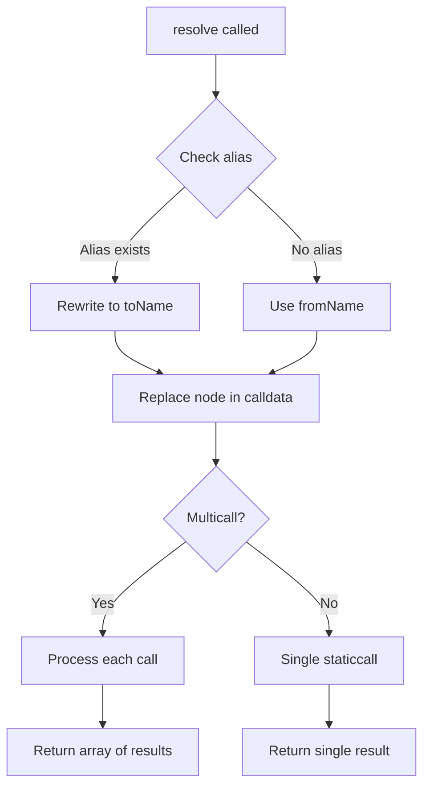

## Overview

The PermissionedResolver is a powerful, upgradeable resolver that supports multiple names with granular permission controls. It implements all standard ENS resolver profiles and adds advanced features like internal aliasing and per-field permissions.

<Info>
This is an upgradeable contract using the UUPS proxy pattern. It requires initialization with an admin address and role bitmap.
</Info>

## Key Features

<CardGroup cols={2}>
  <Card title="Fine-Grained Permissions" icon="shield-halved">
    Control access per name, per field, or globally
  </Card>
  <Card title="Internal Aliasing" icon="link">
    Redirect resolution from one name to another
  </Card>
  <Card title="Multi-Name Support" icon="list">
    Single resolver instance can serve many names
  </Card>
  <Card title="Full Profile Support" icon="address-card">
    Implements all standard ENS resolver interfaces
  </Card>
</CardGroup>

## Architecture

The contract implements these interfaces:

- `IExtendedResolver` - Extended resolution with context
- `IMulticallable` - Batch operations
- `IABIResolver`, `IAddrResolver`, `IAddressResolver` - Address resolution
- `IContentHashResolver` - Content hash storage
- `ITextResolver` - Text records
- `IPubkeyResolver` - Public key storage
- `INameResolver` - Reverse resolution
- `IInterfaceResolver` - EIP-165 interface detection
- `IVersionableResolver` - Record versioning
- `IERC7996` - Feature detection

## Initialization

### Constructor

```solidity
constructor(IHCAFactoryBasic hcaFactory)
```

<ParamField path="hcaFactory" type="IHCAFactoryBasic">
  Hierarchical Context Addressable (HCA) factory for equivalence checking
</ParamField>

### Initialize

```solidity
function initialize(address admin, uint256 roleBitmap) external initializer
```

<ParamField path="admin" type="address">
  The initial admin address (cannot be zero)
</ParamField>

<ParamField path="roleBitmap" type="uint256">
  The roles to grant to the admin
</ParamField>

#### Example: Deploying and Initializing

```solidity
import {PermissionedResolver} from "./PermissionedResolver.sol";
import {PermissionedResolverLib} from "./libraries/PermissionedResolverLib.sol";
import {ERC1967Proxy} from "@openzeppelin/contracts/proxy/ERC1967/ERC1967Proxy.sol";

// Deploy implementation
PermissionedResolver implementation = new PermissionedResolver(hcaFactory);

// Prepare initialization data
uint256 allRoles = 
    PermissionedResolverLib.ROLE_SET_ADDR |
    PermissionedResolverLib.ROLE_SET_TEXT |
    PermissionedResolverLib.ROLE_SET_CONTENTHASH;

bytes memory initData = abi.encodeCall(
    implementation.initialize,
    (adminAddress, allRoles)
);

// Deploy proxy
ERC1967Proxy proxy = new ERC1967Proxy(
    address(implementation),
    initData
);

PermissionedResolver resolver = PermissionedResolver(address(proxy));
```

## Permission System

Permissions are checked across a 2x2 matrix of resources:

<table>
  <thead>
    <tr>
      <th></th>
      <th>Any Part (*)</th>
      <th>Specific Part</th>
    </tr>
  </thead>
  <tbody>
    <tr>
      <td><strong>Any Name (*)</strong></td>
      <td>`resource(0, 0)`</td>
      <td>`resource(0, <part>)`</td>
    </tr>
    <tr>
      <td><strong>Specific Name</strong></td>
      <td>`resource(<namehash>, 0)`</td>
      <td>`resource(<namehash>, <part>)`</td>
    </tr>
  </tbody>
</table>

### Available Roles

```solidity
ROLE_SET_ADDR          // Set addresses for coin types
ROLE_SET_TEXT          // Set text records
ROLE_SET_CONTENTHASH   // Set content hash
ROLE_SET_PUBKEY        // Set public key
ROLE_SET_ABI           // Set ABI data
ROLE_SET_INTERFACE     // Set interface implementer
ROLE_SET_NAME          // Set name (reverse record)
ROLE_SET_ALIAS         // Set internal aliases
ROLE_CLEAR             // Clear all records for a name
ROLE_UPGRADE           // Upgrade contract implementation
```

Each role has a corresponding admin role (shifted left by 128 bits).

### Permission Parts

Fine-grained control is achieved using parts:

```solidity
// Restrict to specific coin type
bytes32 part = PermissionedResolverLib.addrPart(60); // Ethereum

// Restrict to specific text key
bytes32 part = PermissionedResolverLib.textPart("avatar");
```

#### Example: Granting Specific Permissions

```solidity
import {EnhancedAccessControl} from "./access-control/EnhancedAccessControl.sol";

bytes32 node = namehash("alice.eth");

// Allow user to set ANY address for alice.eth
uint256 resource = PermissionedResolverLib.resource(node, 0);
resolver.grantRoles(resource, PermissionedResolverLib.ROLE_SET_ADDR, user);

// Allow user to set ONLY the avatar text for alice.eth
bytes32 avatarPart = PermissionedResolverLib.textPart("avatar");
resource = PermissionedResolverLib.resource(node, avatarPart);
resolver.grantRoles(resource, PermissionedResolverLib.ROLE_SET_TEXT, user);

// Allow user to set Bitcoin address for ANY name
bytes32 btcPart = PermissionedResolverLib.addrPart(0); // Bitcoin
resource = PermissionedResolverLib.resource(0, btcPart);
resolver.grantRoles(resource, PermissionedResolverLib.ROLE_SET_ADDR, operator);
```

## Internal Aliasing

Internal aliasing allows resolution to be redirected from one name to another within the same resolver.

### How Aliasing Works

<Steps>
  <Step title="Longest Match">
    The resolver finds the longest matching suffix in the alias mapping
  </Step>
  
  <Step title="Suffix Rewrite">
    The matched suffix is replaced with the alias target
  </Step>
  
  <Step title="Recursive Check">
    The result is checked for additional aliases
  </Step>
  
  <Step title="Cycle Handling">
    Length-1 cycles apply once; length-2+ cycles cause out-of-gas
  </Step>
</Steps>

### setAlias

```solidity
function setAlias(
    bytes calldata fromName,
    bytes calldata toName
) external
```

<ParamField path="fromName" type="bytes">
  Source DNS-encoded name
</ParamField>

<ParamField path="toName" type="bytes">
  Destination DNS-encoded name
</ParamField>

<Note>
Requires `ROLE_SET_ALIAS` on the root resource.
</Note>

#### Alias Examples

```solidity
// Set up alias from a.eth to b.eth
resolver.setAlias(
    abi.encodePacked(uint8(1), "a", uint8(3), "eth", uint8(0)),
    abi.encodePacked(uint8(1), "b", uint8(3), "eth", uint8(0))
);

// Now resolution works as follows:
// getAlias("a.eth") => "b.eth"
// getAlias("sub.a.eth") => "sub.b.eth"
// getAlias("x.y.a.eth") => "x.y.b.eth"
// getAlias("abc.eth") => "" (no match)
```

### getAlias

```solidity
function getAlias(bytes memory fromName) public view returns (bytes memory toName)
```

<ParamField path="fromName" type="bytes">
  Source DNS-encoded name
</ParamField>

<ResponseField name="toName" type="bytes">
  Destination DNS-encoded name, or empty if not aliased
</ResponseField>

## Record Management

### Setting Records

All setter functions follow the same permission model and emit appropriate events.

#### Address Records

```solidity
// Set Ethereum address
function setAddr(bytes32 node, address addr_) external

// Set address for any coin type
function setAddr(
    bytes32 node,
    uint256 coinType,
    bytes memory addressBytes
) public
```

<Accordion title="Example: Setting Multiple Addresses">
```solidity
bytes32 node = namehash("alice.eth");

// Set Ethereum mainnet address
resolver.setAddr(node, 0x1234567890123456789012345678901234567890);

// Set Bitcoin address
resolver.setAddr(node, 0, hex"0014...");

// Set Linea address (EVM chain 59144)
resolver.setAddr(node, ENSIP19.coinTypeFromChain(59144), abi.encodePacked(lineaAddress));
```
</Accordion>

#### Text Records

```solidity
function setText(
    bytes32 node,
    string calldata key,
    string calldata value
) external
```

<Accordion title="Example: Setting Text Records">
```solidity
bytes32 node = namehash("alice.eth");

// Set avatar
resolver.setText(node, "avatar", "https://example.com/avatar.png");

// Set description
resolver.setText(node, "description", "Alice's ENS profile");

// Set social links
resolver.setText(node, "com.twitter", "alice");
resolver.setText(node, "com.github", "alice");
```
</Accordion>

#### Content Hash

```solidity
function setContenthash(
    bytes32 node,
    bytes calldata hash
) external
```

<Accordion title="Example: Setting IPFS Content">
```solidity
// IPFS hash: ipfs://QmXoypizjW3WknFiJnKLwHCnL72vedxjQkDDP1mXWo6uco
bytes memory contentHash = hex"e3010170122029f2d17be6139079dc48696d1f582a8530eb9805b561eda517e22a892c7e3f1f";

resolver.setContenthash(node, contentHash);
```
</Accordion>

#### Public Key

```solidity
function setPubkey(
    bytes32 node,
    bytes32 x,
    bytes32 y
) external
```

#### ABI

```solidity
function setABI(
    bytes32 node,
    uint256 contentType,
    bytes calldata data
) external
```

<Note>
`contentType` must be a power of 2 (1, 2, 4, 8, etc.). Common values:
- `1` - JSON
- `2` - zlib-compressed JSON
- `4` - CBOR
- `8` - URI
</Note>

#### Interface Implementer

```solidity
function setInterface(
    bytes32 node,
    bytes4 interfaceId,
    address implementer
) external
```

#### Name (Reverse Record)

```solidity
function setName(
    bytes32 node,
    string calldata primary
) external
```

### Clearing Records

```solidity
function clearRecords(bytes32 node) external
```

Increments the version counter, effectively clearing all records for the node.

<Warning>
This cannot be undone. All records (addresses, text, contenthash, etc.) become inaccessible.
</Warning>

## Reading Records

### Address Resolution

```solidity
// Ethereum address
function addr(bytes32 node) public view returns (address payable)

// Multi-coin address
function addr(bytes32 node, uint256 coinType) public view returns (bytes memory)

// Check if address exists
function hasAddr(bytes32 node, uint256 coinType) external view returns (bool)
```

<Accordion title="Example: Multi-Chain Address Lookup">
```solidity
bytes32 node = namehash("alice.eth");

// Get Ethereum address
address ethAddr = resolver.addr(node);

// Get Bitcoin address
bytes memory btcAddr = resolver.addr(node, 0);

// Check if Polygon address is set
bool hasPolygon = resolver.hasAddr(node, ENSIP19.coinTypeFromChain(137));
```
</Accordion>

### Text Records

```solidity
function text(bytes32 node, string calldata key) external view returns (string memory)
```

### Other Records

```solidity
function contenthash(bytes32 node) external view returns (bytes memory)

function pubkey(bytes32 node) external view returns (bytes32 x, bytes32 y)

function ABI(
    bytes32 node,
    uint256 contentTypes
) external view returns (uint256 contentType, bytes memory data)

function interfaceImplementer(
    bytes32 node,
    bytes4 interfaceId
) external view returns (address)

function name(bytes32 node) external view returns (string memory)

function recordVersions(bytes32 node) external view returns (uint64)
```

## Extended Resolution

The `resolve` function enables gasless off-chain resolution with automatic aliasing.

```solidity
function resolve(
    bytes calldata fromName,
    bytes calldata fromData
) external view returns (bytes memory)
```

<ParamField path="fromName" type="bytes">
  DNS-encoded name being resolved
</ParamField>

<ParamField path="fromData" type="bytes">
  Encoded function call (resolver profile query)
</ParamField>

<ResponseField name="result" type="bytes">
  ABI-encoded result of the resolution
</ResponseField>

### Resolution Flow



#### Example: Off-Chain Resolution

```solidity
import {IAddrResolver} from "@ens/contracts/resolvers/profiles/IAddrResolver.sol";

// Prepare the resolver query
bytes memory name = dnsEncode("alice.eth");
bytes memory query = abi.encodeCall(
    IAddrResolver.addr,
    (namehash("alice.eth"))
);

// Resolve (works even if aliased)
bytes memory result = resolver.resolve(name, query);
address ethAddress = abi.decode(result, (address));
```

## Multicall Support

Batch multiple operations in a single transaction.

```solidity
function multicall(bytes[] calldata calls) public returns (bytes[] memory results)

function multicallWithNodeCheck(
    bytes32 /* node */,
    bytes[] calldata calls
) external returns (bytes[] memory)
```

<Note>
`multicallWithNodeCheck` ignores the node parameter since there's no trusted operator in this design. It behaves identically to `multicall`.
</Note>

#### Example: Batch Setting Records

```solidity
bytes32 node = namehash("alice.eth");

bytes[] memory calls = new bytes[](3);
calls[0] = abi.encodeCall(resolver.setAddr, (node, aliceAddress));
calls[1] = abi.encodeCall(resolver.setText, (node, "avatar", "https://..."));
calls[2] = abi.encodeCall(resolver.setText, (node, "com.twitter", "alice"));

resolver.multicall(calls);
```

## Upgradeability

The contract uses the UUPS upgradeable pattern.

```solidity
function _authorizeUpgrade(address newImplementation) internal override
```

<Warning>
Only addresses with `ROLE_UPGRADE` on the root resource can upgrade the contract.
</Warning>

#### Example: Upgrading

```solidity
// Deploy new implementation
PermissionedResolver newImpl = new PermissionedResolver(hcaFactory);

// Upgrade (requires ROLE_UPGRADE)
UUPSUpgradeable(address(resolver)).upgradeToAndCall(
    address(newImpl),
    "" // no initialization needed
);
```

## Events

All standard ENS resolver events plus:

```solidity
event AliasChanged(
    bytes indexed indexedFromName,
    bytes indexed indexedToName,
    bytes fromName,
    bytes toName
);

event VersionChanged(bytes32 indexed node, uint64 newVersion);
```

## Errors

```solidity
error UnsupportedResolverProfile(bytes4 selector);
error InvalidEVMAddress(bytes addressBytes);
error InvalidContentType(uint256 contentType);
```

## Gas Optimization Tips

<AccordionGroup>
  <Accordion title="Use Multicall for Batch Operations">
    Setting multiple records in one transaction saves on base transaction costs.
  </Accordion>
  
  <Accordion title="Minimize Permission Checks">
    Grant permissions at the name level (not field level) when possible.
  </Accordion>
  
  <Accordion title="Avoid Deep Alias Chains">
    Each alias lookup costs gas. Keep alias chains short.
  </Accordion>
  
  <Accordion title="Use clearRecords Sparingly">
    This increments the version and orphans storage, which is expensive.
  </Accordion>
</AccordionGroup>

## Security Considerations

<Warning>
**Admin Keys**: The initial admin has full control. Use a multisig or governance contract.
</Warning>

<Warning>
**Upgrade Authority**: The `ROLE_UPGRADE` holder can change contract logic. Protect this carefully.
</Warning>

<Note>
**HCA Context**: The contract uses Hierarchical Context Addressable addressing for permission checks. Ensure the HCA factory is properly configured.
</Note>

<Tip>
**Permission Granularity**: Start with broader permissions and narrow down as needed. It's easier to restrict than to grant after the fact.
</Tip>

## Complete Integration Example

```solidity
pragma solidity ^0.8.13;

import {PermissionedResolver} from "./PermissionedResolver.sol";
import {PermissionedResolverLib} from "./libraries/PermissionedResolverLib.sol";
import {ERC1967Proxy} from "@openzeppelin/contracts/proxy/ERC1967/ERC1967Proxy.sol";

contract ProfileManager {
    PermissionedResolver public resolver;
    
    constructor(address hcaFactory) {
        // Deploy implementation
        PermissionedResolver impl = new PermissionedResolver(IHCAFactoryBasic(hcaFactory));
        
        // Deploy proxy with initialization
        bytes memory initData = abi.encodeCall(
            impl.initialize,
            (address(this), type(uint256).max) // grant all roles
        );
        
        ERC1967Proxy proxy = new ERC1967Proxy(address(impl), initData);
        resolver = PermissionedResolver(address(proxy));
    }
    
    function setupUserProfile(bytes32 node, address user) external {
        // Grant user permission to manage their profile
        uint256 resource = PermissionedResolverLib.resource(node, 0);
        uint256 roles = 
            PermissionedResolverLib.ROLE_SET_ADDR |
            PermissionedResolverLib.ROLE_SET_TEXT |
            PermissionedResolverLib.ROLE_SET_CONTENTHASH;
        
        resolver.grantRoles(resource, roles, user);
    }
    
    function setUserProfile(
        bytes32 node,
        address addr,
        string memory avatar,
        string memory twitter
    ) external {
        bytes[] memory calls = new bytes[](3);
        calls[0] = abi.encodeCall(resolver.setAddr, (node, addr));
        calls[1] = abi.encodeCall(resolver.setText, (node, "avatar", avatar));
        calls[2] = abi.encodeCall(resolver.setText, (node, "com.twitter", twitter));
        
        resolver.multicall(calls);
    }
}
```

## Related Contracts

<CardGroup cols={3}>
  <Card title="PermissionedResolverLib" icon="book">
    Storage layout and helper functions
  </Card>
  <Card title="EnhancedAccessControl" icon="shield">
    Role-based access control
  </Card>
  <Card title="ResolverProfileRewriterLib" icon="pen">
    Node rewriting utilities
  </Card>
</CardGroup>
