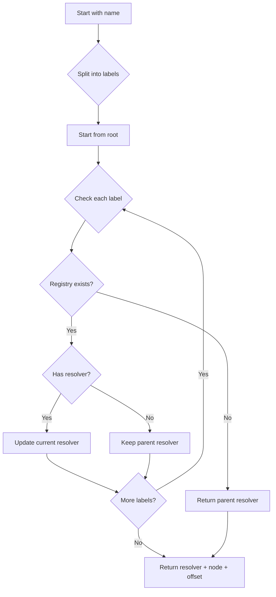

## Overview

The UniversalResolverV2 contract extends the ENS universal resolution system to support multiple registries in the ENS v2 architecture. It provides a unified interface for resolving names across different registry namespaces while maintaining backward compatibility with the ENS v1 resolver interface.

<Info>
UniversalResolverV2 inherits from `AbstractUniversalResolver` and uses the `LibRegistry` library for registry traversal and resolution.
</Info>

## Key Features

<CardGroup cols={2}>
  <Card title="Multi-Registry Support" icon="network-wired">
    Resolve names across multiple connected registries in the hierarchy
  </Card>
  <Card title="Canonical Lookups" icon="magnifying-glass">
    Find canonical names for registries and canonical registries for names
  </Card>
  <Card title="Registry Traversal" icon="diagram-project">
    Walk the entire registry ancestry for any given name
  </Card>
  <Card title="CCIP-Read Compatible" icon="globe">
    Supports batch gateway providers for off-chain resolution
  </Card>
</CardGroup>

## Contract Address

The contract is deployed with an immutable reference to the root registry:

```solidity
IRegistry public immutable ROOT_REGISTRY;
```

## Constructor

```solidity
constructor(
    IRegistry root,
    IGatewayProvider batchGatewayProvider
)
```

<ParamField path="root" type="IRegistry">
  The root registry contract address
</ParamField>

<ParamField path="batchGatewayProvider" type="IGatewayProvider">
  Gateway provider for CCIP-Read batch operations
</ParamField>

## Core Resolution

### findResolver

Finds the resolver, node, and offset for a given name by traversing the registry hierarchy.

```solidity
function findResolver(
    bytes memory name
) public view returns (
    address resolver,
    bytes32 node,
    uint256 offset
)
```

<ParamField path="name" type="bytes">
  DNS-encoded name to resolve
</ParamField>

<ResponseField name="resolver" type="address">
  The resolver address, or `address(0)` if not found
</ResponseField>

<ResponseField name="node" type="bytes32">
  The namehash of the resolved portion
</ResponseField>

<ResponseField name="offset" type="uint256">
  Offset into the name where the resolver was found
</ResponseField>

#### Example: Finding a Resolver

```solidity
// Resolve "alice.eth"
bytes memory name = hex"05616c696365036574680000"; // DNS-encoded "alice.eth"

(address resolver, bytes32 node, uint256 offset) = universalResolver.findResolver(name);

if (resolver != address(0)) {
    // Found a resolver for alice.eth or eth
    // Use it to query records
}
```

<Note>
The resolver returned might be for the exact name or for a parent in the hierarchy. The `offset` parameter indicates which portion of the name was actually resolved.
</Note>

## Canonical Name Operations

### findCanonicalName

Constructs the canonical DNS-encoded name for a given registry address.

```solidity
function findCanonicalName(
    IRegistry registry
) external view returns (bytes memory)
```

<ParamField path="registry" type="IRegistry">
  The registry contract to name
</ParamField>

<ResponseField name="name" type="bytes">
  DNS-encoded canonical name, or empty if not canonical
</ResponseField>

#### Example: Getting Canonical Name

```solidity
// Get canonical name for a registry
IRegistry ethRegistry = IRegistry(0x123...);
bytes memory canonicalName = universalResolver.findCanonicalName(ethRegistry);

if (canonicalName.length > 0) {
    // Registry is canonical and has a name
    // canonicalName might be DNS-encoded "eth"
}
```

<Warning>
Returns an empty bytes array if the registry is not canonical or cannot be named from the root.
</Warning>

### findCanonicalRegistry

Finds the canonical registry for a given DNS-encoded name.

```solidity
function findCanonicalRegistry(
    bytes calldata name
) external view returns (IRegistry)
```

<ParamField path="name" type="bytes">
  DNS-encoded name to look up
</ParamField>

<ResponseField name="registry" type="IRegistry">
  Canonical registry address, or `IRegistry(address(0))` if not canonical
</ResponseField>

#### Example: Verifying Canonical Registry

```solidity
// Check if "alice.eth" points to a canonical registry
bytes memory name = hex"05616c696365036574680000";

IRegistry registry = universalResolver.findCanonicalRegistry(name);

if (address(registry) != address(0)) {
    // This is a canonical registry for alice.eth
    // The registry's canonical name equals "alice.eth"
}
```

<Info>
A registry is canonical for a name if:
1. The registry exists at that name path
2. Walking backwards from the registry produces the same name
</Info>

## Registry Hierarchy Traversal

### findRegistries

Finds all registries in the ancestry of a name, from most specific to root.

```solidity
function findRegistries(
    bytes calldata name
) external view returns (IRegistry[] memory)
```

<ParamField path="name" type="bytes">
  DNS-encoded name to traverse
</ParamField>

<ResponseField name="registries" type="IRegistry[]">
  Array of registries in label-order (most specific to root)
</ResponseField>

#### Example: Walking the Registry Tree

```solidity
// Get all registries for "sub.alice.eth"
bytes memory name = hex"037375620561616c696365036574680000";

IRegistry[] memory registries = universalResolver.findRegistries(name);

// Result array structure:
// [0] = registry for "sub.alice.eth" (or null if doesn't exist)
// [1] = registry for "alice.eth" (or null if doesn't exist)
// [2] = registry for "eth"
// [3] = root registry
```

<Tip>
This is useful for understanding the full resolution path and checking permissions at each level.
</Tip>

#### Traversal Examples

Here are the results for different name queries:

<AccordionGroup>
  <Accordion title="Empty name (root)">
    ```solidity
    findRegistries("") = [<root>]
    ```
  </Accordion>
  
  <Accordion title="Top-level domain">
    ```solidity
    findRegistries("eth") = [<eth>, <root>]
    ```
  </Accordion>
  
  <Accordion title="Second-level domain">
    ```solidity
    findRegistries("alice.eth") = [<alice>, <eth>, <root>]
    ```
  </Accordion>
  
  <Accordion title="Non-existent subdomain">
    ```solidity
    // If sub.alice.eth doesn't exist but alice.eth does
    findRegistries("sub.alice.eth") = [null, <alice>, <eth>, <root>]
    ```
  </Accordion>
</AccordionGroup>

## Resolution Flow

The resolution process follows this hierarchy:



## Integration Examples

### Basic Name Resolution

```solidity
import {UniversalResolverV2} from "./UniversalResolverV2.sol";
import {IAddrResolver} from "@ens/contracts/resolvers/profiles/IAddrResolver.sol";

contract MyContract {
    UniversalResolverV2 public resolver;
    
    function resolveAddress(bytes memory name) external view returns (address) {
        // Find the resolver for this name
        (address resolverAddr, bytes32 node,) = resolver.findResolver(name);
        
        if (resolverAddr == address(0)) {
            return address(0);
        }
        
        // Query the resolver for the address
        return IAddrResolver(resolverAddr).addr(node);
    }
}
```

### Multi-Chain Resolution

```solidity
import {IAddressResolver} from "@ens/contracts/resolvers/profiles/IAddressResolver.sol";

function resolveMultiChainAddress(
    bytes memory name,
    uint256 coinType
) external view returns (bytes memory) {
    (address resolverAddr, bytes32 node,) = universalResolver.findResolver(name);
    
    if (resolverAddr == address(0)) {
        return "";
    }
    
    return IAddressResolver(resolverAddr).addr(node, coinType);
}
```

### Registry Verification

```solidity
function verifyCanonicalOwnership(
    bytes memory name,
    address expectedRegistry
) external view returns (bool) {
    IRegistry actualRegistry = universalResolver.findCanonicalRegistry(name);
    return address(actualRegistry) == expectedRegistry;
}
```

## Gas Optimization

The UniversalResolverV2 uses several optimization techniques:

<Steps>
  <Step title="Immutable Root Registry">
    The root registry reference is immutable, saving gas on every call
  </Step>
  
  <Step title="Library-Based Logic">
    Core resolution logic in `LibRegistry` is compiled inline
  </Step>
  
  <Step title="Early Exit">
    Resolution stops as soon as a resolver is found
  </Step>
  
  <Step title="Memory Efficiency">
    Uses `bytes memory` for name passing to minimize copies
  </Step>
</Steps>

## Security Considerations

<Warning>
**Registry Trust**: The UniversalResolverV2 trusts the root registry and all registries in the hierarchy. Ensure the root registry is properly secured and only creates trusted subregistries.
</Warning>

<Note>
**View Functions**: All resolution functions are `view`, meaning they cannot modify state and are safe to call from other contracts or off-chain.
</Note>

## Related Contracts

<CardGroup cols={2}>
  <Card title="IRegistry" icon="file-contract" href="/api/interfaces/iregistry">
    Registry interface
  </Card>
  <Card title="PermissionedResolver" icon="shield" href="/api/resolver/permissioned-resolver">
    ENS v2 resolver implementation
  </Card>
</CardGroup>
